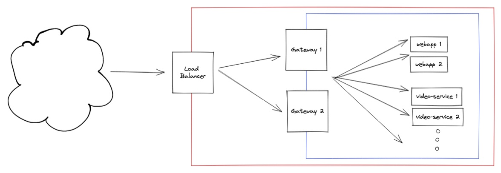

# 01 - Simple Microservice Architecture

A simple example architecture.

 * Each microservice has 2 instances.
 * Dumb load balancer, just forwards requests to the gateway instances.
 * Gateway instances (Spring Cloud Gateway) forward the requests to the other alive instances using consul and depending on the URL path.
   `.../video` goes to `video-service` and everything else goes to `webapp`
 * Deployments happen with ansible? Ansible does the deployments sequentially, if the first fails and goes down, the second server will get the trafic (consul service discovery).

## Questions

#### How does the load balancer fit in this picture?
All the trafic will go to the load balancer only, meaning the DNS will resolve to the load balancers IP, the gateways are not directly accessible from the outside. This LB could be dumb (only forwarding with round robin) like in this example or could also be smart (sticky sessions, forwarding depending on the load, TLS termination etc.) depending on the requirements.

#### What's the purpose of the gateway?
TODO - more description
If we remove the gateway, we now have to make the LB smart. In this example we assume that we only have a simple LM which only can forward requests.
 * TODO -> example maybe with an AWS ALB where we put the forwarding logic there? Would that be enough to remove the gateway? What about the logs to track the requests? Can you configure AWS ALB to send logs to an ELK stack for example?

* TODO - How does the user session work with load balancers? Sticky sessions can be configured with AWS ALB, what about using a session store like the DB or Redis?
* TODO - deployment?
* TODO - microservice / api other authentication ways? JWT?