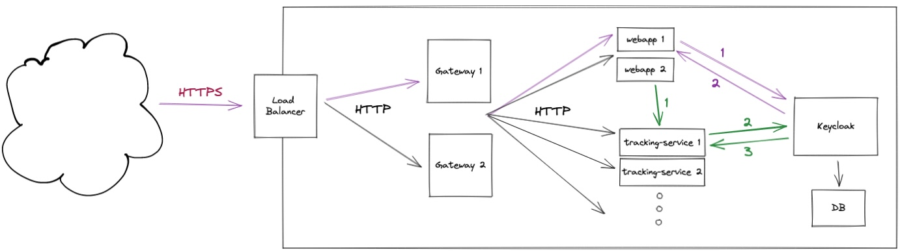

# SSO with Keycloak

### Overview



 * SSL is handled by the load balancer, all external requests coming in has to be HTTPS
 * **User Authentication Flow** (purple): if an endpoint requires a logged in user, the service will ask keycloak
 * **Service-to-service Authentication Flow** (green): service accounts are used for auth between services

### User Authentication
The Microservices need to extend and configure `KeycloakWebSecurityConfigurerAdapter`.
Then they will be able to use things like `@PreAuthorize("hasRole('user')")` (is user logged in) to restrict access.

### Service-to-Service authentication
Service accounts can be used in keycloak to do service to service auth.
As an example, lets say we have 2 services, 
`webapp` and `tracking-service` and `tracking-service` has an endpoint `/api/tracking` which accepts POST requests.
But these requests should only be valid if they were sent from another service (`@PreAuthorize("hasRole('tracking')")`).

You can define a service account in Keycloak and assign it a role, for example `tracking`.
Then in properties in `webapp` you can provide the service-account credentials like this:

```java
spring.security.oauth2.client.registration.keycloak-service-account.client-id=webapp
spring.security.oauth2.client.registration.keycloak-service-account.client-secret=${tracking-service-account.credentials.secret}
```

Now when a request is sent from `webapp` to `tracking-service`, keyclaok will see these credentials and will authenticate `webapp`.
Since the service-account used by `webapp` has the required role, the request will be processed.


