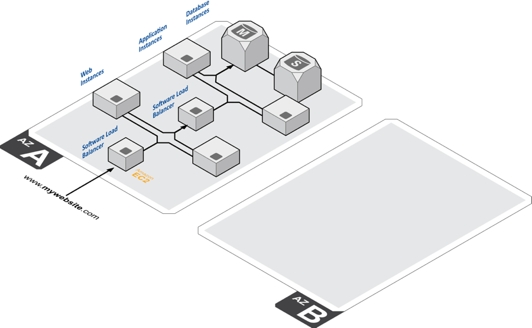
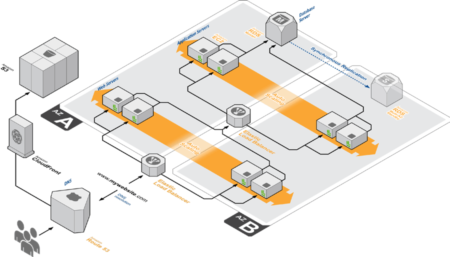

# AWS

 * A Comprehensive Guide to Building a Scalable Web App on Amazon Web Services: https://www.airpair.com/aws/posts/building-a-scalable-web-app-on-amazon-web-services-p1
 * AWS basics playlist: https://www.youtube.com/playlist?list=PL55RiY5tL51pgPovJKg6HFMFqiGNSZtQ5
 * AWS VPC & Subnets basics: https://www.youtube.com/watch?v=bGDMeD6kOz0
## AWS regions Regions and Availability Zones

An **AWS Region** is a geographical location with a **collection of availability zones** mapped to physical data centers in that region. Every region is **physically isolated** from and independent of every other region in terms of location, power, water supply, etc. This level of isolation is critical for workloads with compliance and data sovereignty requirements where guarantees must be made that user data does not leave a particular geographic region.

Inside each region, you will find **two or more availability zones** with each zone hosted in separate data centers from another zone. The largest AWS region, `us-east-1`, has five zones. Moving forward, new AWS regions will have three or more zones whenever possible. When you create certain resources in a region, you will be asked to choose a zone in which to host that resource.

Some regions and their availability zones:
 - **eu-central-1** - Europe (Frankfurt)
   - 3 availability zones: **eu-central-1a, eu-central-1b, eu-central-1c**
 - **eu-west-1** - Europe (Ireland)
   - 3 availability zones
 - **eu-west-2** - Europe (London) 
   - 3 availability zones

## AWS availability zones
Availability zones are **distinct locations** in a region that are engineered to be **isolated from failures** in other availability zones. By launching instances in separate AZ's, you can protect your application from the failure of a single location.
 * A common misconception is that a single zone equals a single data center. In fact, each zone is backed by one or more physical data centers.

Any AWS resource that you launch (like EC2/RDS) must be placed in a VPC subnet.
Any given subnet must be located in an availability zone. You can (and should) utilize multiple AZ's to create redundancy in your architecture. This is what allows for high availability and fault tolerant systems.
 * A VPC can span over multiple availability zones
 * Each VPC is region-specific, so the VPCs in each region are separate and not connected whatsoever. It is possible to connect multiple VPC in different regions using VPN or Inter-region VPC peering.
 * After creating a VPC, you can add one or more subnets in each availability zone. Each subnet **must reside entirely within one AZ and cannot span zones**.

### Why are availability zones such an important and foundational concept in Amazon Web Services?
The diagram below illustrates a region with two zones where only one is being utilized. The architecture mirrors what a typical three-tier application running in a user's single on-premises data center may look like. While there are redundant servers running in each tier, the data center itself is a single point of failure.

In contrast to this architecture, the diagram below illustrates the recommended practice of spanning an application across multiple zones. By placing cloud instances/virtual servers for each tier in each zone, users are able to eliminate a single point of failure. Amazon Elastic Load Balancers situated at different application tiers ensure that even if an entire zone goes offline, traffic will be directed to the appropriate one. It's worth pointing out that the ELBs "live" outside the zones and are therefore not impacted by the failure of any particular one. ELB is one of many AWS services that have a regional scope and can span across zones in a given region. Other services like Route 53 is global in scope, as shown below, and provides services to multiple Regions.
 

## VPC and Subnets

**Virtual private clouds (VPC)**: A VPC is a virtual network that closely resembles a traditional network that you'd operate in your own data center. After you create a VPC, you can add subnets.

**Subnets**: A subnet is a range of IP addresses in your VPC. A subnet must reside in a single Availability Zone. After you add subnets, you can deploy AWS resources in your VPC.

 - Can Subnets talk to eachother? Should I create different subnets for each environment or different VPC's? Should I use the default VPC or create a new one?

## Route 53

## Load balancer Differences
https://www.youtube.com/watch?v=p0YZBF03r5A

## How to learn for the AWS cert exams?
 - https://www.youtube.com/watch?v=pmEqDqRn9V0
 - https://www.youtube.com/watch?v=e9aUvmm4SU0

## Good Playlists to learn AWS:
 - https://www.youtube.com/playlist?list=PLv2a_5pNAko0Mijc6mnv04xeOut443Wnk
 - https://www.youtube.com/playlist?list=PL55RiY5tL51pgPovJKg6HFMFqiGNSZtQ5