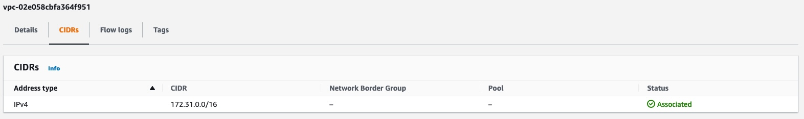
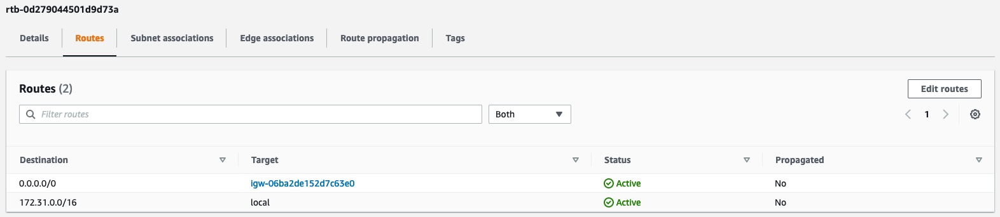
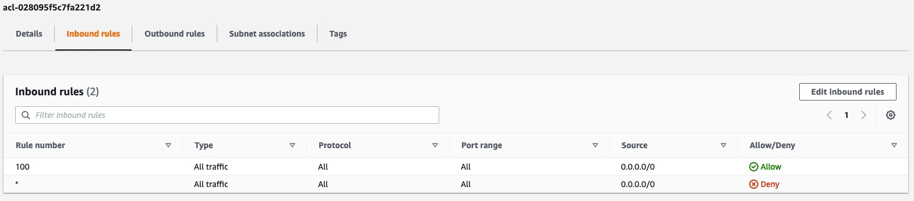

# AWS

 * A Comprehensive Guide to Building a Scalable Web App on Amazon Web Services: https://www.airpair.com/aws/posts/building-a-scalable-web-app-on-amazon-web-services-p1
 * AWS basics playlist: https://www.youtube.com/playlist?list=PL55RiY5tL51pgPovJKg6HFMFqiGNSZtQ5
 * AWS VPC & Subnets basics: https://www.youtube.com/watch?v=bGDMeD6kOz0
## AWS regions Regions and Availability Zones

An **AWS Region** is a geographical location with a **collection of availability zones** mapped to physical data centers in that region. Every region is **physically isolated** from and independent of every other region in terms of location, power, water supply, etc. This level of isolation is critical for workloads with compliance and data sovereignty requirements where guarantees must be made that user data does not leave a particular geographic region.

Inside each region, you will find **two or more availability zones** with each zone hosted in separate data centers from another zone. The largest AWS region, `us-east-1`, has five zones. Moving forward, new AWS regions will have three or more zones whenever possible. When you create certain resources in a region, you will be asked to choose a zone in which to host that resource.

Some regions and their availability zones:
 - **eu-central-1** - Europe (Frankfurt)
   - 3 availability zones: **eu-central-1a, eu-central-1b, eu-central-1c**
 - **eu-west-1** - Europe (Ireland)
   - 3 availability zones
 - **eu-west-2** - Europe (London) 
   - 3 availability zones

## AWS availability zones
Availability zones are **distinct locations** in a region that are engineered to be **isolated from failures** in other availability zones. By launching instances in separate AZ's, you can protect your application from the failure of a single location.
 * A common misconception is that a single zone equals a single data center. In fact, each zone is backed by one or more physical data centers.

Any AWS resource that you launch (like EC2/RDS) must be placed in a VPC subnet.
Any given subnet must be located in an availability zone. You can (and should) utilize multiple AZ's to create redundancy in your architecture. This is what allows for high availability and fault tolerant systems.
 * A VPC can span over multiple availability zones
 * Each VPC is region-specific, so the VPCs in each region are separate and not connected whatsoever. It is possible to connect multiple VPC in different regions using VPN or Inter-region VPC peering.
 * After creating a VPC, you can add one or more subnets in each availability zone. Each subnet **must reside entirely within one AZ and cannot span zones**.

### Why are availability zones such an important and foundational concept in Amazon Web Services?
The diagram below illustrates a region with two zones where only one is being utilized. The architecture mirrors what a typical three-tier application running in a user's single on-premises data center may look like. While there are redundant servers running in each tier, the data center itself is a single point of failure.

In contrast to this architecture, the diagram below illustrates the recommended practice of spanning an application across multiple zones. By placing cloud instances/virtual servers for each tier in each zone, users are able to eliminate a single point of failure. Amazon Elastic Load Balancers situated at different application tiers ensure that even if an entire zone goes offline, traffic will be directed to the appropriate one. It's worth pointing out that the ELBs "live" outside the zones and are therefore not impacted by the failure of any particular one. ELB is one of many AWS services that have a regional scope and can span across zones in a given region. Other services like Route 53 is global in scope, as shown below, and provides services to multiple Regions.
 

## VPC and Subnets

**Virtual private clouds (VPC)**: A VPC is a virtual network that closely resembles a traditional network that you'd operate in your own data center. After you create a VPC, you can add subnets.
 - By default a **route table** is attached to your VPC which controls routing of outgoing network requests. 

This VPC's CIDR is `172.31.0.0/16`

And here you can see that this **routing table** is configured to route every destination inside `172.31.0.0/16` to `local`, which means any resource inside the VPC. Other requests will be routed to the **internet gateway** resource.

**Subnets**: A subnet is a range of IP addresses in your VPC. A subnet must reside in a single Availability Zone. After you add subnets, you can deploy AWS resources in your VPC.
 - You can control if instances in a subnet should get public IPs when they launch (`Auto-assign public IPv4 address -> Yes/No`).
 - With **Network ACL's** you can control the network trafic on a subnet level. You can control which trafic may enter or leave a particular subnet. In contrast to security groups, which can control the trafic on an instance level.
 - By default each subnet can access other subnets because all subnets get the default Netowrk ACL, which allows all outgoing and incoming trafic.

You don't have options like **public subnet** or a **private subnet** on AWS. A subnet is a subnet. What makes it private or public is the network trafic configuration. If you want a private subnet, you could disable giving IP addresses to instances and also block outgoing traffic to the internet for example.
Resources in the same VPC will still be able to connect to that private subnet via the internal IP addresses.
 * If you want your private subnet resources (with no public IPs) to access the internet, you can redirect the outgoing trafic to a **NAT gateway (Network Address Translation)**, a service managed by AWS. A NAT gateway translates the internal IPs to public ones and forwards it to the internet gateway in order to send the request out to the internet. This way our private instances can access the internet while still not having public IP's, which means they won't be accessible from the outside by default.
    * TODO not sure how this works under the hood. Are only the responses routed back to the private resources? Meaning they can be reached from the outside ONLY if they have sent a request and waiting for a response? 

**NAT Gateway**: The same concept as our home network. Our devices do not have a public IP address, they just have internal/private IP addresses and when they request something, the trafic goes over the NAT gateway (router) to the internet. The response to that returns to the the router and there the NAT routing table is checked and that's how the response can then be routed to the correct device. Only the NAT gateway (or router in this case) has a public IP address.

**Network Access Control List**: A network access control list (ACL) is an optional layer of security for your VPC that acts as a firewall for controlling traffic in and out of one or more subnets.
 - TODO does NACL also apply to the VPC?

Here is the default NACL which allows all outgoing and incoming trafic from and to subnets:

 - TODO Should I create different subnets for each environment or different VPC's? Should I use the default VPC or create a new one?

A VPC comes with the following resources attached to it:
 * Subnets
 * Route Tables
 * Intenet gateways

## EC2

 * Each instance will be assigned a random IPv4 address. If you want a fixed IP address, you need to create an `Elastic IP`.
 * Security groups are assigned to each instance which controls inbound and outbound traffic rules for that instance.
 * Network ACL's are assigned to subnets and controls inbound and outbound traffic rules for that subnet.
 * By default each account has the following resources: a VPC, 3 Subnets (in each AZ), a Network ACL, an internat gateway, route table

## Route 53

## Load balancer Differences
https://www.youtube.com/watch?v=p0YZBF03r5A

## How to learn for the AWS cert exams?
 - https://www.youtube.com/watch?v=pmEqDqRn9V0
 - https://www.youtube.com/watch?v=e9aUvmm4SU0

## Good Playlists to learn AWS:
 - https://www.youtube.com/playlist?list=PLv2a_5pNAko0Mijc6mnv04xeOut443Wnk
 - https://www.youtube.com/playlist?list=PL55RiY5tL51pgPovJKg6HFMFqiGNSZtQ5