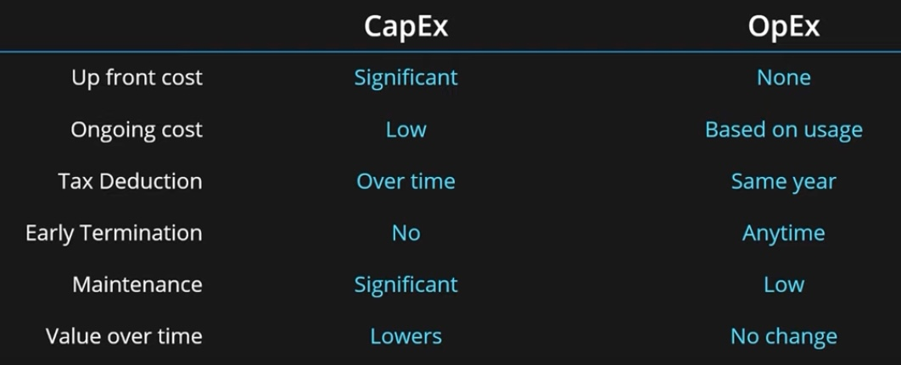

# Azure AZ-900

Sources:
 * https://www.youtube.com/playlist?list=PLGjZwEtPN7j-Q59JYso3L4_yoCjj2syrM

## 1. Cloud Computing and Vocabulary

**Cloud Computing**: A delivery model for services like:
 * Storage
 * Compute Power
 * Networking
 * Analytics
 * and more...

### Key Charasteristics:
 - **Scalability**: The ability of the system to scale. Increasing the size of the resource is scaling up or vertical scaling (more RAM, more CPU cores), adding more resources to your environment means scaling horizontally (Scaling out is increasing, scaling in is decreasing). 
 - **Elasticity**: The ability of the system to scale dynamically, depending on the load. The user workload changes over time and properly designed systems will allocate and deallocate resources to match that workload change over time. If this is done automatically, it is also called automatic scaling which means elasticity.
 - **Agility**: The ability to allocate and deallocate (scale) resources quickly. You can request resources manually (over a GUI) or automated (with an API). There is a big difference between the cloud and on-premise data centers in the time that it takes to get that resource. In the cloud, you can get your requested resources in secons/mins/hours but in on-premise data centers it might take days/weeks/months.
 - **Fault tolerance**: The ability to remain up and running during component and service failures. In the cloud most services have built in fault tolerance, so you won't even notice the local failures. 
 - **Disaster Recovery**: The ability to recover from an event that has taken down the service. A disaster is a serious disruption of services caused by natural or human-induces causes (earth quakes, fires, power grid failures etc.). Disaster Recovery simply means two copies of the same application in two or more different Azure regions and setting up replication between them. Infront of those services should be a simple DNS router so your users are automatically redirected to the working serivce in case of a disaster.
 - **High availability**: Its a measure of system uptime for users/services. High Availability is the ability to keep services running for extended periods of time with very little downtime.
  **Availability = Uptime / Uptime + Downtime**. Availability can be calculated yearly, monthly or daily. 99% Availability means only 3.65 days of downtime per year. If you go for 99.9%, it is only 8.7 hours per year. Most companies go for 99.99% (52 minutes per year.)

## 2. Principle of economies of scale
Simply put, as your company grows, your price per unit (service) lowers. A small comapanies price per unit will be high, a medium companies will be medium, a large comapies will be low and will be much more competitive on the market. This is also what drives the cost of Azure services.

## 3. Capital Expenditure (CapEx) vs Operational Expenditure (OpEx)
**CapEx**: Being able to commit to resources upfront and make that big inital investment.CapEx basically means buying your own infrastructure.
 * Own infrastructure
 * Big initial investment. The company wants to make a future proof investment and therefore might get a bigger and better infrastructure, which drives the costs higher. Once the investment is made, the maintenance costs are low over time. But until the your company can use its infrastructure to its full potential, the unused compute power is wasted.
 * Lots of maintenance required. Hiring Support staff, power and networking, hardware failures etc.

**OpEx**: Reting infrastructure, buying services. The cloud perfectly fits into this model.
 * Rent infrastructure
 * No initial investment, pay for what you use. The server capacity always matches what you are using
 * Minimal maintenance, only operational work is needed.

## 4. Consumption-based Pricing Model
 * No upfront costs. You only start paying, when you are actually using the resources.
 * No wasted resources.
 * Pay for additional resource when needed. Stop paying when you don't need them.
 * Multiple pricing components per service
 * Very granular usage measurement

## 5. IaaS vs PaaS vs SaaS cloud service models
 * **Infrastructure**: servers, networking, storage, hardware & virtualization
 * **Platform**: operating system, middleware, runtime (docker, node etc.)
 * **Software**: data & applications

Middleware is software that lies between an operating system and the applications running on it. Essentially functioning as a hidden translation layer, middleware enables communication and data management for distributed applications. It’s sometimes called plumbing, as it connects two applications together so data and databases can be easily passed between the “pipe”.

**On-premises**:
 * Cloud provider manages nothing
 * You manage everything

**Infrastructure as a Service**:
 * Cloud provider manages infrastructure
 * You manage platform & software
 * Examples: AWS, Azure, GCP

**Platform as a Service**
 * Cloud provider manages infrastructure & platform
 * You manage software
 * Examples: AWS Elastic Beanstalk, Heroku

**Software as a Service**
 * Cloud provider manages everything
 * You manage nothing
 * Examples: Outlook, Gmail, Dropbox

## 6. Public, Private & Hybrid cloud deployment models
**Public Cloud**:
 * Everything runs on the hardware provided by the cloud provider
 * No local hardware
 * Some of your service will share hardware with other customers

Advantages:
 * No CapEx
 * High availability & Agility
 * Pay as you go pricing
 * No hardware maintenance

Disadvantages:
 * Security & Compliance
 * Ownership
 * Unique business requirements might not be implemented

**Private Cloud**:
 * Everything runs on your own datacenter

Advantages:
 * Can support any scenario
 * Control over security 
 * Can meet any security & compliance requirements

Disadvantages:
 * Initial CapEx
 * Limited Agility
 * IT skills & expertise are mandatory

**Hybrid Cloud**:
 * Combines public & private clouds

Advantages:
 * Great flexibility
 * Run legacy apps in private cloud 
 * Utilize existing infrastructure
 * Meet any security requirements

Disadvantages:
 * Can be more expensive
 * Complicated to manage
 * IT skills & expertise are mandatory

## 7. Geographies, Regions & Availability Zones
**Regions**: a group of data centers that are connected with each other with high throughput internet connectivity. Microsoft has many regions across the globe (60+ regions) of different sizes. They can be as small as 
single data center or they can contain multiple ones but what is most important is that they are globally distributed. 
 * a geographical area on the planet that
 * one but usually more data centers connected with low latency network (<2 milliseconds)
 * You always need to pick a location (the region) for your resources.
 * Some services are available only in certain regions
 * Some services are global services, as such are not assigned/deployed in a specific region
 * Special government regions (US DoD Central, US Gov Virginia, etc.)
 * Special pertnered regions (China Easy, China North) where Microsoft is providing the services, but it doesnt really manage the data-centers itself.

To measure the latency from your location to the different Regions: https://azurespeedtest.azurewebsites.net/
And to see which services are available in which region: https://azure.microsoft.com/de-de/explore/global-infrastructure/products-by-region/

**Availability Zone**: Azure availability zones are physically separate locations within each Azure region that are tolerant to local failures. Failures can range from software and hardware failures to events such as earthquakes, floods, and fires. Tolerance to failures is achieved because of redundancy and logical isolation of Azure services. To ensure resiliency, a minimum of three separate availability zones are present in all availability zone-enabled regions.

Azure availability zones are connected by a high-performance network with a round-trip latency of less than 2ms. They help your data stay synchronized and accessible when things go wrong. Each zone is composed of one or more datacenters equipped with independent power, cooling, and networking infrastructure. Availability zones are designed so that if one zone is affected, regional services, capacity, and high availability are supported by the remaining two zones.
 * Not all regions have availability zones

Two service categories:
 * **Zonal services**: (Virtual Machines, Disks, etc.) You can choose to which AZ you are deploying your resource. In case of a VM, you can now choose to deploy for example one VM to one AZ and the other to a different AZ.
 * **Zone-redundant services**: (SQL Database, Storage, etc.) Services which allow you to take advantage of multiple AZ's out of the box. With a simple check of an option, your services will automatically replicate data across multiple AZ's and will work in a redundant way. If an AZ goes down, you won't even notice that.

**Region pairs**: In case for the whole region going down, Microsoft created region pairs. Each region has a region pair. Paired regions are at least 300 miles away from eachother. Microsoft assures if one region goes down, the pair region will be up. Region pairs are static and cannot be chosen. Again, with a simple check (for some services) you can enable replication across regions. Some pairs: East US - West US, North Europe (Ireland) - West Europe (Netherlands).

All regions and region paris are grouped into **geographies**. Each geohraphy describes a discrete market and typically contains two or more regions. Ensures data residency, sovereignty, resiliency and compliance requirements are met. Geographies are also fault tolerant to protect from region wide failures. Each region belongs to only to one geography.

## 8. Resources, Resource Groups & Resource Manager

## ...