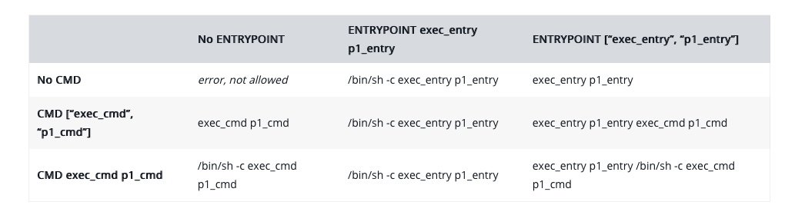

# Docker

## Entrypoint vs CMD
The `ENTRYPOINT` specifies a command that will always be executed when the container starts.
The `CMD` specifies arguments that will be fed to the ENTRYPOINT.
 * The default `ENTRYPOINT` is `/bin/sh -c`
 * `ENTRYPOINT` is often pointed to an entry script (rather than a command) that can do many useful things.
 * `ENTRYPOINT` can be overwritten with `--entrypoint`
 * `CMD` will be overridden when running the container with alternative arguments.

For example, if your Dockerfile is the following:
```dockerfile
FROM debian:wheezy
ENTRYPOINT ["/bin/ping"]
CMD ["localhost"]
```

 * running the image without any argument (`docker run -it test`) will ping the localhost (`/bin/ping localhost`)
 * running the image with an argument will ping the argument: `$ docker run -it test google.com` will execute (`/bin/ping google.com`

For comparison, if your Dockerfile is:
```dockerfile
FROM debian:wheezy
CMD ["/bin/ping", "localhost"]
```

 * Running the image without any argument (`$ docker run -it test`) will ping the localhost (`/bin/ping localhost`)
 * But running the image with an argument will run the argument. `docker run -it test bash` will run bash

## Shell Form vs Exec Form
 * Shell form: `CMD [ "echo", "$HOME" ]`
 * Exec form:  `CMD echo $HOME`

This table ([docs](https://docs.docker.com/engine/reference/builder/#understand-how-cmd-and-entrypoint-interact)) shows the difference:



 * The exec form is parsed as a JSON array, which means that you must use double-quotes (“) around words not single-quotes (‘).
 * Unlike the shell form, the exec form does not invoke a command shell. This means that normal shell processing does not happen. For example, `CMD [ "echo", "$HOME" ]` will not do variable substitution on `$HOME`. If you want shell processing then either use the shell form or execute a shell directly, for example: `CMD [ "sh", "-c", "echo $HOME" ]`. When using the exec form and executing a shell directly, as in the case for the shell form, it is the shell that is doing the environment variable expansion, not docker.

## Starting a service inside docker
By default systemd does not exists, so you need to use sysvinit to start a service.
For example, to start nginx: `service nginx start` or (the equivalent) `/etc/init.d/nginx start`

## Docker and SystemD
Docker does not use/support systemd inside their container. This is by design. The idea is you run a separate container for each service.
Docker should be running a process in the foreground in your container and it will be spawned as PID 1 within the container's pid namespace. Docker is designed for process isolation, not for OS virtualization, so there are no other OS processes and daemons running inside the container (like systemd, cron, syslog, etc), only your entrypoint or command you run.
 * Podman supports running `systemd` inside containers.

### Why do you want to run systemd inside a container?
There are lots of reasons to run systemd inside a system, such as:

 1. Multiservice containers—Lots of people want to take existing multi-service applications out of VMs and run them inside of containers. We would prefer that they break apart these applications into microservices, but some people can’t or don’t have time yet.  So running them as services launched out of unit files by systemd makes sense.
 2. Systemd unit files—Most applications that run inside of containers are built from code that was run in VMs or on host systems. These applications have a unit file that was written for the application and understands how to run the application. It can be better to launch the service via the supported method, rather than to hack up your own init service.

That being said, there are also lots of reasons not to run systemd in containers. The main one is that systemd/journald controls the output of containers, whereas tools like Kubernetes and OpenShift expect the containers to log directly to stdout and stderr. So, if you are going to manage your containers via Orchestrator like these, then you should think twice about using systemd-based containers. Additionally, the upstream community of Docker and Moby were often hostile to the use of systemd in a container.

## Podman
Podman supports running `systemd` **inside containers** and it even supports creating systemd `.service` files which can start a container when the service itself is started.

Running Podman on MacOs M1:
 * After the installation, you need to run `podman machine init` which downloads a VM.
 * Running `podman machine start` crashes the system on MacOs 12.1 and 12.3
 * Upgrading the system to MacOs 12.4+ solves the problem but now it (currently, September 2022) prints `Error: cannot start VM podman-machine-default: VM already running or starting`

## TODO
 * Copy a docker image between locations. Images can be zipped.