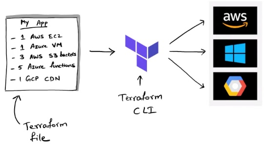
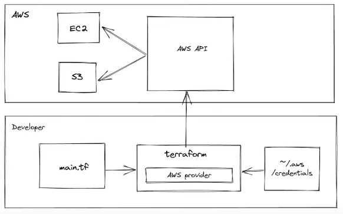
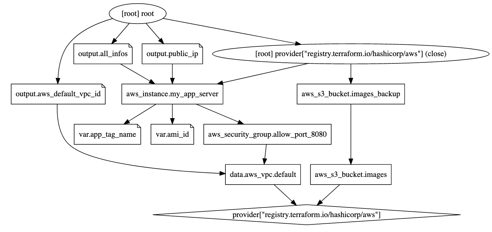

# Terraform

## Agenda
 1. Understanding IaC
 2. Introduction to Terraform
 3. Learning HCL - the Terraform language
 4. Work with AWS using Terraform
 5. Terraform workflow and commands
 6. Enterprise Terraform best practices
 7. Terraform Modules

### What is DevOps?
Before DevOps, there were the operations team and the developer team. The dev team were responsible of developing the code and the ops team were responsible of deploying and making sure that the code was running properly.

The ops team:
 * Take over "finished" code from the dev team
 * Provision servers, buy the servers, mount them on the server racks and setup everything
 * Deploy the application
 * Configure the application and also the environment (for example JVM, load balancer etc.)
 * Support infrastructure. When things went wrong, they were to respond first.

The way we build and deploy things have changed:
 * Cloud providers like AWS, Azure, etc. now provided the hardware as a service.
 * Continuous deployment is a new requirement. You can't just do a big bang deployment once a while, instead the app sometimes needs to be deployed every 30 minutes.
 * Deployment complexity has increased and this complexity can only be reduced when you know the internal workings of the application. So the developer working on the code can deploy the app in a much easier and better way than a ops person. The alternative is that the dev team documenting every single detail when handing the app over to the ops team. 

These points lead to the movement to make this ops process more automated and controled by software, instead of separate teams. Once you move all of those operations to software, now you have the `development of operations`, you can develop code which does those operations.
 * Operations are now code-driven
 * Developers knowladge is needed for operations, so it's better when the developer writes additional code for operations.
 * You'll now have 2 types of code: Dev code vs Ops code.

> **Infrastructure as Code**: it's basically the goal of converting the steps done manually (for example in a Jenkins or AWS GUI) and automating them using different tools. These tools generally take code to describe the wanted state / configuration. This makes it easy to review, test, create different environments and provides also a version history.

Infrastructure as code is usually **declarative**.

Errors are better handled in terraform compared to an imperative style.

### Terraform vs Ansible
Terraform is responsible for provisioning resousrces on the cloud. It is **not responsible** for what is created on those resources. You can provide an image (AMI or Docker Image) which terraform will then configure on the resource, but creating and managing that image or changing things on the resource is not done with terraform. `Ansible` or `Puppet` are used for those task.

### Terraform
> The definiton is (verb): to change the environment of a planet to make it able to support life. For example "terraforming Mars".

Terraform is an open-source infrastructure as code software tool that provides a consistent CLI workflow to manage hundreds of cloud services.
Terraform codifies cloud APIs into declarative configuration files.
 * Cloud agnostic: meaning you can write your config/code and then with that code provision resources on different cloud providers.
 * Cloud Indepentent: meaning you don't need to work with the cloud. You can also provision your own local machines. It's extensible, so you can write your own plugins.

#### Terraform Workflow



1. Write declarative IaC using HCL (HashiCorp Configuration Language)
2. Run Terraform CLI on the IaC code
   * Init
   * Plan
   * Apply

#### State
State describes the resources which are already available(???). Terraform checks the state before it does changes. This makes sure that your code is **idempotent**.

### Authentication

* **Don't put your account ID and secret in any terraform file!**

The best way is to use the CLI's of the cloud providers. Those will setup and store your credentials in the best way possible and terraform will also know where and how to access those credentials depending on which provider its using.

#### AWS
We will use the `awscli` to configure and store our credentials. Once this is done, terraform will know where to find the credentials.

On the AWS page, after you've logged in, `click on your email > Security Credentials > Access keys > Create New Access Key`.

On your command line type `aws configure` and paste the key id and secret that you just generated and provide the other config options.

This will create an `~/.aws` (in your home directory) folder with 2 files inside:

`~/.aws/config`:
```
[default]
region = eu-central-1
output = json
```

`~/.aws/credentials`:
```
[default]
aws_access_key_id = ...
aws_secret_access_key = ...
```

### Creating Our First Terraform File
The convention is to name your file `main.tf`, which will be the entrypoint.
Here is a simple configuration file:

```
// cloud provider -> AWS
provider "aws" {
  profile = "default"
  region = "eu-central-1"
}

/*
    two strings follow the resource keyword:
        resource "type" "name" {
*/
// aws_instance is an EC2 instance
resource "aws_instance" "my_app_server" {
  ami = "ami-083e9f3cc36cb84a8" // ubuntu ami
  instance_type = "t2.micro"
}
```

Now we need to run `terraform init` on the directory where this `main.tf` file is located.

This will create:
 * `.terraform` folder
 * `.terraform.lock.hcl` file

### Plan

The `terraform plan` command creates an execution plan, which lets you preview the changes that Terraform plans to make to your infrastructure.

 * Reads the current state of any already-existing remote objects to make sure that the Terraform state is up-to-date.
 * Compares the current configuration to the prior state and noting any differences.
 * Proposes a set of change actions that should, if applied, make the remote objects match the configuration.

The plan command alone will not actually carry out the proposed changes, and so you can use this command to check whether the proposed changes match what you expected before you apply the changes or share your changes with your team for broader review.

### Apply
The `terraform apply` command executes the actions proposed in a Terraform plan.
Before running apply, `terraform plan` will be executed and terraform will ask the user again for a confirmation before carrying out the changes.

If we do a `terraform plan` now, terraform will check again what the state is and if we changed our `main.tf`. In our case, no changes have been made, so the output will be like this: 

```
No changes. Your infrastructure matches the configuration.

Terraform has compared your real infrastructure against your configuration and
found no differences, so no changes are needed.
```

### Destroy
`terraform destroy` will destroy the resources which terraform created.

### Plan with Output File
By default the `terraform plan` command just outputs the plan and does not remember or save it anywhere.
You can use the `-out=...` flag to output the plan into a file.
The best practice is to use the `.tfplan`
 * `terraform plan -out=myplan.tfplan`

Now you can use that exact plan to make your changes `terraform apply ./myplan.tfplan` 

### Resource names

```
resource "type" "name" {
    ...
}
```

This name will be used in terraform only, it's not reflected to AWS or Azure. It's like a variable used by terraform.
Terraform will create an object with that name and you can then use that name to lookup things from there.

If you want to change the name of your resources, you can use the `tags` block to do so.

```
resource "aws_instance" "my_app_server" {
  ami = "ami-083e9f3cc36cb84a8" // ubuntu ami
  instance_type = "t2.micro"
  tags = {
    Name = "my_app_server"
  }
}
```

Now when we do a `terraform apply`, it will do an **update in-place** and will only change the name of the EC2 instance from `-` to `my_app_server`

### Destructive Changes 
Not all changes are modifications. If you want to change the tag of a currently running resource, it can be done **in-place** without destroying the resource.
But some changes cannot be made in-place. For example if you want to change the AMI, a `terraform plan` will show you `Plan: 1 to add, 0 to change, 1 to destroy`. Meaning it first has to destroy and then add the resource again.


### Overview



You can think of the AWS provider as a plugin which knows how to interpret and work with the aws provider block. Terraform, using this provider reads the `main.tf` and the credentials and then will call the right AWS API which then will create the wanted resources.

### Folder Structure

 * `.terraform/`
 * `terraform.tfstate`
 * `terraform.tfstate.backup`
 * `.terraform.lock.hcl`

#### .terraform/
When we did a `terraform init`, it scanned our `main.tf` and identified the providers you need. By default, the bare bones terraform does not have the ability to work with AWS or Azure. When it sees that we want to work with AWS, it will download the AWS provider and save it in the `.terraform` folder. It is an executable file which will do the communication to AWS. Terraform will invoke this executable.

#### terraform.tfstate
This JSON file contains the **state of your infrastructure**.

 * This file can also contain sensitive information

Terraform must store state about your managed infrastructure and configuration. This state is used by Terraform to map real world resources to your configuration, keep track of metadata, and to improve performance for large infrastructures.

This state is stored **by default in a local file** named `terraform.tfstate`, but it can also be stored remotely, which works better in a team environment.

Terraform uses this local state to create plans and make changes to your infrastructure.
 * Prior to any operation (apply, plan, etc.), Terraform does a `refresh` to update the state (stored in the local file if not specified otherwise) with the real infrastructure.

In laymens terms, Terraform stores the state of your infrastructure locally in `terraform.tfstate`, before you do an operation, it first does a `refresh`, meaning it will fetch information about the remote resources and will compare it to the locally stored state to find out if anything changed on remote. If yes, it will show you the changes.
For example, if you have a running EC2 instance and you change the tag manually on the GUI and then do a `terraform apply` or `plan`, terraform will display that you are about to change the tag. For terraform the only important state is what you defined in `main.tf`. If you do an apply, it will again remove all the manual changes and will make sure that the EC2 instance is exactly equal to the state in the `main.tf` (or also `terraform.tfstate`)

##### Refresh
The `terraform refresh` command reads the current settings from all managed remote objects and updates the Terraform state to match.

> **Warning**: This command is deprecated, because its default behavior is unsafe if you have misconfigured credentials for any of your providers. See below for more information and recommended alternatives.

This won't modify your real remote objects, but it will modify the Terraform state.

You shouldn't typically need to use this command, because Terraform automatically performs the same refreshing actions as a part of creating a plan in both the `terraform plan` and `terraform apply` commands. This command is here primarily for backward compatibility, but **we don't recommend using it** because it provides no opportunity to review the effects of the operation before updating the state.

##### Sensitive Data in State

Terraform state **can contain sensitive data**, depending on the resources in use and your definition of "sensitive." The state contains resource IDs and all resource attributes. For resources such as databases, this may contain initial passwords.

When using local state, state is stored in plain-text JSON files.

When using remote state, state is only ever held in memory when used by Terraform. It may be encrypted at rest, but this depends on the specific remote state backend.


#### terraform.tfstate.backup
Serves as a backup. Each time `terraform.tfstate` is updated, the old file will be moved to `terraform.tfstate.backup`. So it's like having a commit history of of 2 commits.

#### .terraform.lock.hcl
This file helps make the runs be deterministic, meaning that each execution will result to the same output. This lock file helps freeze the exact external dependency versions used in the config so that if it's used by other people in the future (when new versions of those external dependencies are present) it will yield the same result.

 * When you do a `terraform init` if no lock file is present, it will create one. If its present then it will use that lock file to get the exact versions.
 * `terraform init -updgrade` will upgrade the versions.

A Terraform configuration may refer to two different kinds of external dependency that come from outside of its own codebase:

  * **Providers**, which are plugins for Terraform that extend it with support for interacting with various external systems.
  * **Modules**, which allow splitting out groups of Terraform configuration constructs (written in the Terraform language) into reusable abstractions.

**Both of these dependency types can be published and updated independently from Terraform itself and from the configurations that depend on them**. For that reason, Terraform must determine which versions of those dependencies are potentially compatible with the current configuration and which versions are currently selected for use.

Version constraints within the configuration itself determine which versions of dependencies are potentially compatible, but after selecting a specific version of each dependency Terraform remembers the decisions it made in a dependency lock file so that it can (by default) make the same decisions again in future.

At present, the dependency lock file tracks **only provider dependencies**. Terraform does not remember version selections for remote modules, and so Terraform will always select the newest available module version that meets the specified version constraints. You can use an exact version constraint to ensure that Terraform will always select the same module version.

### The `terraform` block
The `terraform` block in the main configuration:
 * configures all terraform settings
 * "Expected" terraform version. This is important because in some versions (0.12) there were some breaking changes to terraform.
 * Configures providers
 * `source` defines where the provider comes from.
   By default terraform checks and fetches the providers from the hashicorp registry, if you need to change that, you can specify it in the terraform block 

```
terraform {
  reqired_providers {
    aws = {
        // you can explicitly write this is the provider
        // does not come from hashicops registry
        source = "hashicorp/aws"
        version = "~> 3.27"
    }
  }
  // version of terraform
  required_version = "~>0.12.0"
}
```

#### source = "hashicorp/aws"
 * Provider has two identifiers
 * Unique source address (`hashicorp/aws`)
 * Local name (`aws`), which we used in `main.tf` `provider "aws" {...}`
 * Source address: `[<HOSTNAME>/]<NAMESPACE>/<TYPE>`
   * Hostname (Example: `registry.terraform.io`) can be omitted if its the official registry like here
   * Namespace (Example: `hashicorp`)
   * Type (Example: `aws`)
   * Full soure address: `registry.terraform.io/hashicorp/aws`


### HCL Syntax
The goal of HCL code is to represent infrastructure objects.
Every infrastructure object is respresented using blocks.

```
<BLOCK TYPE> "<BLOCK LABEL>" "<BLOCK LABEL>" {
    // Block body
    <IDENTIFIER> = <EXPRESSION>
}
```

There are some formatting guidelines, for example the equals symbols being aligned. You can use `terraform fmt` to format your code.

```
  profile = "default"
  region  = "eu-central-1"
```

**String Interpolation**

```
tags = {
    Name = "ec2-${var.app_tag_name}"
  }
```

### Variables
```
variable "app_tag_name" {
    description = "Name tag of the application"
    type = string
    default = "my_super_app"
}
```
The variable can then be accessed with `var.app_tag_name` and it will evaluate to `my_super_app`

 * **default**: The value to use if it was not provided. If a value is provided, it will overwrite the default value.
 * **type**: terraform defines some data types, it has to be one of them.
 * **description**:
 * **validation**: You can set rules of how you want the input to look like
 * **sensitive**: if you define a variable as sensitive, terraform won't echo out the value to the console.
 * **nullable**: if its not nullable then you need to define the value upfront, the default value.

```
variable "ami_id" {
    type = string
    description = "The id of the machine image to use for the server"

    validation {
        condition = length(var.ami_id) > 4 && substr(var.ami_id, 0, 4) == "ami-"
        error_message = "Must be a valid AMI id, starting with ami-"
    }
}
```

When you don't have a default value for a variable, you need to assign it. This can be done in 3 ways:
 1. Pass each variable value manually. If you run `terraform plan`, you will get a prompt asking you to provide the values for each variable.
 2. Pass the value with CLI arguments when running the command `terraform plan -var "ami_id=ami-1234"`
 3. Use environment variables `TF_VAR_<var_name>=`. For example `export TF_VAR_ami_id=ami-1234`

#### Input Variables
Values which are provided by you and used by the provider

#### Output Variables
When terraform gets data from the provider and sends it to you. For example to reach an EC2 instance, we needed to go to the AWS-UI to find out the Public IP address of the server. This can be accessed in the terraform console with an output variable.

```
output "var_name" {
    value       = <resource.property>
    description = "..."
    sensitive   = false
}
```

For example, getting the public IP address:

```
output "public_ip" {
    value       = aws_instance.my_app_server.public_ip
    description = "The public IP address of my web server"
}
```

Having this block will print out the value by default to the console when running a terraform command. Which means this can be used to find information about the different instances. For example if you create an output variable with the value `value = aws_instance.my_app_server`, this will print out all the properties of the aws_instance object to the console. All those properties which says `known after apply`, you can get the values of these once it is created.
 * `terraform output` to print only all the output variables
 * The output variables are saved to the state file after do an apply. When you introduced a new output variable it won't be accessible until you do `terraform apply` or `terraform refresh` 

#### Local Variables
If all you need is to avoid duplicating values and you don't want it to be overwritten by the CLI or environment variables, you can use local variables.

```
locals {
  http_port = 80
}

# usage
port = local.http_port
```
#### Variables Best Practices
Recommended is to create a `variable.tf` or `output.tf` file to store your variables and not have them defined in your main tf file. This way you can quickly see what are all the required values that you need to provide (`variable.tf`).

 * The name of the file does not matter as long as it is in the root directory.

Furthermore, you can create a `terraform.tfvars` file and put all the default values of your variables there in a  `key = "value"` format:

```bash
app_tag_name = "my_super_app"
ami_id = "ami-xyz"
...
```

**Using `default` vs `terraform.tfvars`**: they mean different things. Providing a default value means that if nothing was provided, the default should be used but if you put the value in `terraform.tfvars`, you explicitly say that you are providing a value and even if a default exists, it should be overwritten. So, you should still use the `default` keyword if necessary.

### Data Types
 * **string**
 * **number**
 * **bool**
 * **list**
   * `type = list(number) default = [80, 81]`
   * lookup: `var.port_numbers[0]`
 * **map**
   * `type = map(string)`
     `default = { key = "value" key2 = "value2"}`
   * lookup: `lookup(map, key, default)`
 * **object** (you define the structure of the object)
   * type = object({
       ami_name = string
       count    = number
       tags     = list(string)
       enabled  = bool
      })
  * **set**
  * **tuple**
  * **any** (if no type is defined)


### Loops
```python
variable "bucket_names" {
  type = list(string)
  default = ["dev", "test", "prod"]
}

resource "aws_s3_bucket" "app_image_buckets" {
  for_each = toset(var.bucket_names)
  bucket = "202201010157-app_image_bucket-${each.value}"
}
```

### Count property
It's a meta property of a terraform resource. Every terraform resource has a count property which allows you to specify how many of this resource you need.

To create 3 AWS S3 buckets:
```python
resource "aws_s3_bucket" "b" {
  count = 3
}
```

The object `b` will be a list and you can access the different bucket objects by `b[<0-3>]`.

To get the index:
```python
resource "aws_s3_bucket" "b" {
  count = 3
  bucket = "202201010157-app_image_bucket-${count.index}"
}
```

### Data Sources (Data Variables)
Data sources allow Terraform to use information defined outside of Terraform, defined by another separate Terraform configuration, or modified by functions.
 * Each provider may offer data sources alongside its set of resource types.

To load the information of the default AWS VPC into an object:

```python
data "aws_vpc" "default" {
  default = true
}
```

Now we can use that object to access the ID of the VPC:
```python
vpc_id = data.aws_vpc.default.id
```

Another common use case is to get the AMI ID's. If you don't know the AMI ID, you can use different filters and owner id's to fetch the ami id.
This will also always get the ID of the latest AMI.

```python
data "aws_ami" "latest_ubuntu" {
  most_recent = true
  owners = ["099720109477"] # Canonical, is also a data source

  filter {
    name = "name"
    values = ["ubuntu/images/hvm-ssd/ubuntu-*"]
  }
  filter {
    name = "virtualization-type"
    values = ["hvm"]
  }
}
```

 * The **problem** with data sources is that your code can become **non-deterministic**.
 * You might want to avoid depending on data which might change and stick to what you defined.


### Dependencies with Resources
For example, if you have 2 resources which don't depend on eachother (EC2 and S3 Bucket), by default they will be created in parallel. But in the previous example, the `aws_instance` was using the id of a `aws_security_group`, which means the security group needs to be created first and then the EC2 instance.
Terraform is aware of these implicit dependecies.
 * By default API calls happen in parallel if no dependencies
 * If dependencies present, Terraform auto-orders based on dependencies. 
 * For example, if you create 2 buckets and use bucket A's name in bucket B's definition, then this would be an **explicit dependency** and A will be created first.
 * You can also create an **implicit dependency** by using the `depends_on` property.

```python
resoruce "aws_s3_bucket" "images" {...}

resoruce "aws_s3_bucket" "images_backup" {
  depends_on = [
    aws_s3_bucket.images
  ]
}
```

#### Terraform Graph
Terraform manages these dependencies using an internal graph.
You can use `terraform graph` to get a JSON stucture of the dependency graph.
If you need a graphical representation, you can use an online editor like [edotor.net](https://edotor.net/) or a VS Code extension like Graphviz and paste the JSON.




### Real World Terraform

 * Multiple environments
 * Multiple developers

#### Dealing with Multiple Environments
Both of these are possible solutions:
 * **Separate folders for each environment**: the simplest solution but this possibly mean duplicating a lot of configuration. That duplication could be mitigated by using **modules**.
 * **Terraform Workspaces**

You can use Terraform workspaces, to manage multiple environments and multiple states. So far we were using the `default` workspace by default.
`terraform workspace --help` to see the available workspace options
 * `delete`
 * `list`
 * `new`
 * `select`
 * `show`

Create and switch to a new workspace: `terraform workspace new test`. When you are in a different workspace, terraform won't consider the state file of other workspaces, which means you can create resources for `default` and then switch to `test` and run `terraform apply` again and create those resources again.
  
But you might end up with conflicts because of names and identifiers needing to be unique. 

`terraform.workspace` is a variable where you can access the name of the current workspace name. This way you could change you configuration dynamically depending on the environment.
For example:

```python
resource "aws_instance" "example" {
  ami           = "ami-1234"
  instance_type = terraform.workspace = "dev" ? "t2.micro" : "t2.medium"
}
```

#### Dealing with Multiple Developers in a Team
When you run your terraform config, it creates the state file `terraform.tfstate` on your machine. How do you work together with a team using that file?

The solution is to have one `terraform.tfstate` file which all developers can work with at the same time.

One option is to check this file in source control and the other developers will checkout that file. Now you have the same state file. But working like this has lots of problems.
 * A state file can also contain sensitive data, that's one disadvantage.
 * Imagine 2 developers having the same state file. Both now add a resource at the same time. Now they will have different state files, which means a conflict in the state file. So we need some sort of a **locking system**.

The solution is **remote state with locking**. A common shared remote location where the state file will reside and will only be accessed by one person each time. Each terraform command will work with that remote state file.

#### Setup remote backend
 1. Setup an S3 bucket to hold the sate file
 2. Setup a DynamoDb to support locking
 3. Configure the AWS provider to use these two

The s3 bucket needs to be created/present before running `terraform init` or else Terraform will complain `Error: Failed to get existing workspaces: S3 bucket does not exist. The referenced S3 bucket must have been previously created`.

One way to do this is to first create all the resources with Terraform and after that setup the remote state configuration

The DynamoDB attribute and the hash_key **must be named exactly** `LockID`, anything else and you will get the following error:

```
 Error: Error acquiring the state lock
│ 
│ Error message: 2 errors occurred:
│       * ValidationException: One or more parameter values were invalid: Missing the key lockID in the item
│       status code: 400, request id: U12S2N6PPFKHF6H5N5FATTTDBJVV4KQNSO5AEMVJF66Q9ASUAAJG
│       * ValidationException: The provided key element does not match the schema
│       status code: 400, request id: N9AAVOC2KLAR5SPQSFP9667SMJVV4KQNSO5AEMVJF66Q9ASUAAJG
```
 * Comment out the `backend` block
 * `terraform init` 
 * `terraform apply` without the `backend` block to create the s3 bucket and the dynamoDB
 * Wait for resources to initialize fully
 * Uncomment the `backend` block
 * `terraform init`, this will ask you `Do you want to copy existing state to the new backend?`, 
   say yes and now Terraform will migrate your state to the remote s3 bucket with locking enabled

Terraform will now acquire a lock before running `plan` and `apply` and will save the state to the s3 bucket.

> All objects in an S3 bucket needs to be deleted before the bucket can be deleted.
> Be careful when doing a `terraform destroy`, it might delete some resources (like the dynamoDB) but not delete the S3 bucket
> This might give you errors with locking since the DB is gone. You can use the `-lock=false` flag to ignore locking.

### Modules


### ...


### TODO
 * AWS don't use the root user to do everything, create a restricted user.
 * What should we check into source control?
 * Terratest, localstack
 * Testing infrastructure and best practices: 
   * https://www.youtube.com/watch?v=xhHOW0EF5u8
   * https://www.youtube.com/watch?v=RTEgE2lcyk4