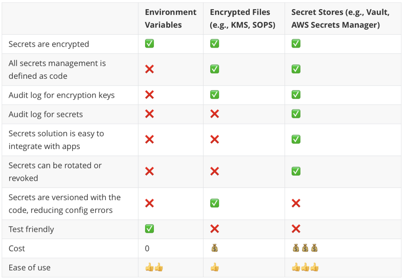

# Terraform

Some resources used:
 * Javabrains
 * https://blog.gruntwork.io/how-to-manage-terraform-state-28f5697e68fa

## What is DevOps?
Before DevOps, there were the operations team and the developer team. The dev team were responsible of developing the code and the ops team were responsible of deploying and making sure that the code was running properly.

The ops team:
 * Take over "finished" code from the dev team
 * Provision servers, buy the servers, mount them on the server racks and setup everything
 * Deploy the application
 * Configure the application and also the environment (for example JVM, load balancer etc.)
 * Support infrastructure. When things went wrong, they were to respond first.

The way we build and deploy things have changed:
 * Cloud providers like AWS, Azure, etc. now provided the hardware as a service.
 * Continuous deployment is a new requirement. You can't just do a big bang deployment once a while, instead the app sometimes needs to be deployed every 30 minutes.
 * Deployment complexity has increased and this complexity can only be reduced when you know the internal workings of the application. So the developer working on the code can deploy the app in a much easier and better way than a ops person. The alternative is that the dev team documenting every single detail when handing the app over to the ops team. 

These points lead to the movement to make this ops process more automated and controled by software, instead of separate teams. Once you move all of those operations to software, now you have the `development of operations`, you can develop code which does those operations.
 * Operations are now code-driven
 * Developers knowladge is needed for operations, so it's better when the developer writes additional code for operations.
 * You'll now have 2 types of code: Dev code vs Ops code.

> **Infrastructure as Code**: it's basically the goal of converting the steps done manually (for example in a Jenkins or AWS GUI) and automating them using different tools. These tools generally take code to describe the wanted state / configuration. This makes it easy to review, test, create different environments and provides also a version history.

Infrastructure as code is usually **declarative**.

Errors are better handled in terraform compared to an imperative style.

## Terraform vs Ansible
Terraform is responsible for provisioning resousrces on the cloud. It is **not responsible** for what is created on those resources. You can provide an image (AMI or Docker Image) which terraform will then configure on the resource, but creating and managing that image or changing things on the resource is not done with terraform. `Ansible` or `Puppet` are used for those task.

## Terraform
> The definiton is (verb): to change the environment of a planet to make it able to support life. For example "terraforming Mars".

Terraform is an open-source infrastructure as code software tool that provides a consistent CLI workflow to manage hundreds of cloud services.
Terraform codifies cloud APIs into declarative configuration files.
 * Cloud agnostic: meaning you can write your config/code and then with that code provision resources on different cloud providers.
 * Cloud Indepentent: meaning you don't need to work with the cloud. You can also provision your own local machines. It's extensible, so you can write your own plugins.

### Terraform Workflow


1. Write declarative IaC using HCL (HashiCorp Configuration Language)
2. Run Terraform CLI on the IaC code
   * Init
   * Plan
   * Apply

### State
State describes the resources which are already available(???). Terraform checks the state before it does changes. This makes sure that your code is **idempotent**.

## Authentication

* **Don't put your account ID and secret in any terraform file!**

The best way is to use the CLI's of the cloud providers. Those will setup and store your credentials in the best way possible and terraform will also know where and how to access those credentials depending on which provider its using.

### AWS
We will use the `awscli` to configure and store our credentials. Once this is done, terraform will know where to find the credentials.

On the AWS page, after you've logged in, `click on your email > Security Credentials > Access keys > Create New Access Key`.

On your command line type `aws configure` and paste the key id and secret that you just generated and provide the other config options.

This will create an `~/.aws` (in your home directory) folder with 2 files inside:

`~/.aws/config`:
```
[default]
region = eu-central-1
output = json
```

`~/.aws/credentials`:
```
[default]
aws_access_key_id = ...
aws_secret_access_key = ...
```

## Creating Our First Terraform File
The convention is to name your file `main.tf`, which will be the entrypoint.
Here is a simple configuration file:

```
// cloud provider -> AWS
provider "aws" {
  profile = "default"
  region = "eu-central-1"
}

/*
    two strings follow the resource keyword:
        resource "type" "name" {
*/
// aws_instance is an EC2 instance
resource "aws_instance" "my_app_server" {
  ami = "ami-083e9f3cc36cb84a8" // ubuntu ami
  instance_type = "t2.micro"
}
```

Now we need to run `terraform init` on the directory where this `main.tf` file is located.

This will create:
 * `.terraform` folder
 * `.terraform.lock.hcl` file

## Plan

The `terraform plan` command creates an execution plan, which lets you preview the changes that Terraform plans to make to your infrastructure.

 * Reads the current state of any already-existing remote objects to make sure that the Terraform state is up-to-date.
 * Compares the current configuration to the prior state and noting any differences.
 * Proposes a set of change actions that should, if applied, make the remote objects match the configuration.

The plan command alone will not actually carry out the proposed changes, and so you can use this command to check whether the proposed changes match what you expected before you apply the changes or share your changes with your team for broader review.

## Apply
The `terraform apply` command executes the actions proposed in a Terraform plan.
Before running apply, `terraform plan` will be executed and terraform will ask the user again for a confirmation before carrying out the changes.

If we do a `terraform plan` now, terraform will check again what the state is and if we changed our `main.tf`. In our case, no changes have been made, so the output will be like this: 

```
No changes. Your infrastructure matches the configuration.

Terraform has compared your real infrastructure against your configuration and
found no differences, so no changes are needed.
```

## Destroy
`terraform destroy` will destroy the resources which terraform created.

## Plan with Output File
By default the `terraform plan` command just outputs the plan and does not remember or save it anywhere.
You can use the `-out=...` flag to output the plan into a file.
The best practice is to use the `.tfplan`
 * `terraform plan -out=myplan.tfplan`

Now you can use that exact plan to make your changes `terraform apply ./myplan.tfplan` 

## Resource names

```
resource "type" "name" {
    ...
}
```

This name will be used in terraform only, it's not reflected to AWS or Azure. It's like a variable used by terraform.
Terraform will create an object with that name and you can then use that name to lookup things from there.

If you want to change the name of your resources, you can use the `tags` block to do so.

```
resource "aws_instance" "my_app_server" {
  ami = "ami-083e9f3cc36cb84a8" // ubuntu ami
  instance_type = "t2.micro"
  tags = {
    Name = "my_app_server"
  }
}
```

Now when we do a `terraform apply`, it will do an **update in-place** and will only change the name of the EC2 instance from `-` to `my_app_server`

## Destructive Changes 
Not all changes are modifications. If you want to change the tag of a currently running resource, it can be done **in-place** without destroying the resource.
But some changes cannot be made in-place. For example if you want to change the AMI, a `terraform plan` will show you `Plan: 1 to add, 0 to change, 1 to destroy`. Meaning it first has to destroy and then add the resource again.


## Overview


You can think of the AWS provider as a plugin which knows how to interpret and work with the aws provider block. Terraform, using this provider reads the `main.tf` and the credentials and then will call the right AWS API which then will create the wanted resources.

## Folder Structure

 * `.terraform/`
 * `terraform.tfstate`
 * `terraform.tfstate.backup`
 * `.terraform.lock.hcl`

#### .terraform/
When we did a `terraform init`, it scanned our `main.tf` and identified the providers you need. By default, the bare bones terraform does not have the ability to work with AWS or Azure. When it sees that we want to work with AWS, it will download the AWS provider and save it in the `.terraform` folder. It is an executable file which will do the communication to AWS. Terraform will invoke this executable.

#### terraform.tfstate
This JSON file contains the **state of your infrastructure**.

 * This file can also contain sensitive information

Terraform must store state about your managed infrastructure and configuration. This state is used by Terraform to map real world resources to your configuration, keep track of metadata, and to improve performance for large infrastructures.

This state is stored **by default in a local file** named `terraform.tfstate`, but it can also be stored remotely, which works better in a team environment.

Terraform uses this local state to create plans and make changes to your infrastructure.
 * Prior to any operation (apply, plan, etc.), Terraform does a `refresh` to update the state (stored in the local file if not specified otherwise) with the real infrastructure.

In laymens terms, Terraform stores the state of your infrastructure locally in `terraform.tfstate`, before you do an operation, it first does a `refresh`, meaning it will fetch information about the remote resources and will compare it to the locally stored state to find out if anything changed on remote. If yes, it will show you the changes.
For example, if you have a running EC2 instance and you change the tag manually on the GUI and then do a `terraform apply` or `plan`, terraform will display that you are about to change the tag. For terraform the only important state is what you defined in `main.tf`. If you do an apply, it will again remove all the manual changes and will make sure that the EC2 instance is exactly equal to the state in the `main.tf` (or also `terraform.tfstate`)

##### Refresh
The `terraform refresh` command reads the current settings from all managed remote objects and updates the Terraform state to match.

> **Warning**: This command is deprecated, because its default behavior is unsafe if you have misconfigured credentials for any of your providers. See below for more information and recommended alternatives.

This won't modify your real remote objects, but it will modify the Terraform state.

You shouldn't typically need to use this command, because Terraform automatically performs the same refreshing actions as a part of creating a plan in both the `terraform plan` and `terraform apply` commands. This command is here primarily for backward compatibility, but **we don't recommend using it** because it provides no opportunity to review the effects of the operation before updating the state.

##### Sensitive Data in State
Terraform state **can contain sensitive data**, depending on the resources in use and your definition of "sensitive." The state contains resource IDs and all resource attributes. For resources such as databases, this may contain initial passwords.

When using local state, state is stored in plain-text JSON files.

When using remote state, state is only ever held in memory when used by Terraform. It may be encrypted at rest, but this depends on the specific remote state backend.

#### terraform.tfstate.backup
Serves as a backup. Each time `terraform.tfstate` is updated, the old file will be moved to `terraform.tfstate.backup`. So it's like having a commit history of of 2 commits.

#### .terraform.lock.hcl
This file helps make the runs be deterministic, meaning that each execution will result to the same output. This lock file helps freeze the exact external dependency versions used in the config so that if it's used by other people in the future (when new versions of those external dependencies are present) it will yield the same result.

 * When you do a `terraform init` if no lock file is present, it will create one. If its present then it will use that lock file to get the exact versions.
 * `terraform init -updgrade` will upgrade the versions.

A Terraform configuration may refer to two different kinds of external dependency that come from outside of its own codebase:

  * **Providers**, which are plugins for Terraform that extend it with support for interacting with various external systems.
  * **Modules**, which allow splitting out groups of Terraform configuration constructs (written in the Terraform language) into reusable abstractions.

**Both of these dependency types can be published and updated independently from Terraform itself and from the configurations that depend on them**. For that reason, Terraform must determine which versions of those dependencies are potentially compatible with the current configuration and which versions are currently selected for use.

Version constraints within the configuration itself determine which versions of dependencies are potentially compatible, but after selecting a specific version of each dependency Terraform remembers the decisions it made in a dependency lock file so that it can (by default) make the same decisions again in future.

At present, the dependency lock file tracks **only provider dependencies**. Terraform does not remember version selections for remote modules, and so Terraform will always select the newest available module version that meets the specified version constraints. You can use an exact version constraint to ensure that Terraform will always select the same module version.

## The `terraform` block
The `terraform` block in the main configuration:
 * configures all terraform settings
 * "Expected" terraform version. This is important because in some versions (0.12) there were some breaking changes to terraform.
 * Configures providers
 * `source` defines where the provider comes from.
   By default terraform checks and fetches the providers from the hashicorp registry, if you need to change that, you can specify it in the terraform block 

```
terraform {
  reqired_providers {
    aws = {
        // you can explicitly write this is the provider
        // does not come from hashicops registry
        source = "hashicorp/aws"
        version = "~> 3.27"
    }
  }
  // version of terraform
  required_version = "~>0.12.0"
}
```

#### source = "hashicorp/aws"
 * Provider has two identifiers
 * Unique source address (`hashicorp/aws`)
 * Local name (`aws`), which we used in `main.tf` `provider "aws" {...}`
 * Source address: `[<HOSTNAME>/]<NAMESPACE>/<TYPE>`
   * Hostname (Example: `registry.terraform.io`) can be omitted if its the official registry like here
   * Namespace (Example: `hashicorp`)
   * Type (Example: `aws`)
   * Full soure address: `registry.terraform.io/hashicorp/aws`


## HCL Syntax
The goal of HCL code is to represent infrastructure objects.
Every infrastructure object is respresented using blocks.

```
<BLOCK TYPE> "<BLOCK LABEL>" "<BLOCK LABEL>" {
    // Block body
    <IDENTIFIER> = <EXPRESSION>
}
```

There are some formatting guidelines, for example the equals symbols being aligned. You can use `terraform fmt` to format your code.

```
  profile = "default"
  region  = "eu-central-1"
```

**String Interpolation**

```
tags = {
    Name = "ec2-${var.app_tag_name}"
  }
```

## Variables

 * **Input variables**: Can be seen as input parameters. If no default value is given, then they it means they are required for you to pass in.
 * **Local variables**: Used only locally to avoid duplicating values. Values cannot be passed in or overwritten.
 * **Output variables**: These are the "return values" of functions/resources. For instance, you can get the IP address of an EC2 instance after its provisioned.
   Output variables can be used to map data between resources. If you need to wait for the IP of a resource to setup your firewall rule, 
   you can use output variables for that.

### Input Variables
Values which are provided by you and used by the provider.

```
variable "app_tag_name" {
    description = "Name tag of the application"
    type = string
    default = "my_super_app"
}
```
The variable can then be accessed with `var.app_tag_name` and it will evaluate to `my_super_app`

 * **default**: The value to use if it was not provided. If a value is provided, it will overwrite the default value.
 * **type**: terraform defines some data types, it has to be one of them.
 * **description**:
 * **validation**: You can set rules of how you want the input to look like
 * **sensitive**: if you define a variable as sensitive, terraform won't echo out the value to the console.
 * **nullable**: if its not nullable then you need to define the value upfront, the default value.

```
variable "ami_id" {
    type = string
    description = "The id of the machine image to use for the server"

    validation {
        condition = length(var.ami_id) > 4 && substr(var.ami_id, 0, 4) == "ami-"
        error_message = "Must be a valid AMI id, starting with ami-"
    }
}
```

When you don't have a default value for a variable, you need to assign it. This can be done in 3 ways:
 1. Pass each variable value manually. If you run `terraform plan`, you will get a prompt asking you to provide the values for each variable.
 2. Pass the value with CLI arguments when running the command `terraform plan -var "ami_id=ami-1234"`
 3. Use environment variables `TF_VAR_<var_name>=`. For example `export TF_VAR_ami_id=ami-1234`

Order of precedence (highest to lowest):
 1. Command line `-var` or `-var-file`
 2. `*.auto.tfvars` file
 3. `terraform.tfvars` file
 4. `TF_VAR_<name>` environment variable
 5. Default value in the declaration block
 6. Manual entry during plan/apply

### Output Variables
When terraform gets data from the provider and sends it to you. For example to reach an EC2 instance, we needed to go to the AWS-UI to find out the Public IP address of the server. This can be accessed in the terraform console with an output variable.

```
output "var_name" {
    value       = <resource.property>
    description = "..."
    sensitive   = false
}
```

For example, getting the public IP address:

```
output "public_ip" {
    value       = aws_instance.my_app_server.public_ip
    description = "The public IP address of my web server"
}
```

Having this block will print out the value by default to the console when running a terraform command. Which means this can be used to find information about the different instances. For example if you create an output variable with the value `value = aws_instance.my_app_server`, this will print out all the properties of the aws_instance object to the console. All those properties which says `known after apply`, you can get the values of these once it is created.
 * `terraform output` to print only all the output variables
 * The output variables are saved to the state file after do an apply. When you introduced a new output variable it won't be accessible until you do `terraform apply` or `terraform refresh` 

### Local Variables
If all you need is to avoid duplicating values and you don't want it to be overwritten by the CLI or environment variables, you can use local variables.

```
locals {
  http_port = 80
}

# usage
port = local.http_port
```

### Variables Best Practices
> Terraform does not ascribe any special meaning to which filenames you use and how many files you have. Terraform instead reads all of the `.tf` files and considers their contents together. Therefore you can freely move the blocks from your main.tf file into as many separate `.tf` files in the same directory as you like, and Terraform will consider the configuration to be exactly equivalent as long as you change nothing in the contents of those blocks while you do it

Recommended is to create a `variables.tf` or `outputs.tf` file to store your variables and not have them defined in your main tf file. This way you can quickly see what are all the required values that you need to provide (`variables.tf`).

Furthermore, you can create a `terraform.tfvars` file and put all the **non-sensitive** values of your variables there in a  `key = "value"` format:

```bash
app_tag_name = "my_super_app"
ami_id = "ami-xyz"
...
```

**Using `default` vs `terraform.tfvars`**: they mean different things. Providing a default value means that if nothing was provided, the default should be used but if you put the value in `terraform.tfvars`, you explicitly say that you are providing a value and even if a default exists, it should be overwritten. So, you should still use the `default` keyword if necessary.

## Data Types
 * **string**
 * **number**
 * **bool**
 * **list**
   * `type = list(number) default = [80, 81]`
   * lookup: `var.port_numbers[0]`
 * **map**
   * `type = map(string)`
     `default = { key = "value" key2 = "value2"}`
   * lookup: `lookup(map, key, default)`
 * **object** (you define the structure of the object)
   * type = object({
       ami_name = string
       count    = number
       tags     = list(string)
       enabled  = bool
      })
  * **set**
  * **tuple**
  * **any** (if no type is defined)


## Loops
```python
variable "bucket_names" {
  type = list(string)
  default = ["dev", "test", "prod"]
}

resource "aws_s3_bucket" "app_image_buckets" {
  for_each = toset(var.bucket_names)
  bucket = "202201010157-app_image_bucket-${each.value}"
}
```

## Count property
It's a meta property of a terraform resource. Every terraform resource has a count property which allows you to specify how many of this resource you need.

To create 3 AWS S3 buckets:
```python
resource "aws_s3_bucket" "b" {
  count = 3
}
```

The object `b` will be a list and you can access the different bucket objects by `b[<0-3>]`.

To get the index:
```python
resource "aws_s3_bucket" "b" {
  count = 3
  bucket = "202201010157-app_image_bucket-${count.index}"
}
```

You can use `count` to conditionally create resources:

```python
resource "aws_s3_bucket_versioning" "bucket_versioning" {
  # Count can be used to conditionally create a resource
  count = var.enable_versioning == true ? 1 : 0
  
  bucket = aws_s3_bucket.s3_bucket.id
  versioning_configuration {
    status = "Enabled"
  }
}
```

## Data Sources (Data Variables)
Data sources allow Terraform to use information defined outside of Terraform, defined by another separate Terraform configuration, or modified by functions.
 * Each provider may offer data sources alongside its set of resource types.

To load the information of the default AWS VPC into an object:

```python
data "aws_vpc" "default" {
  default = true
}
```

Now we can use that object to access the ID of the VPC:
```python
vpc_id = data.aws_vpc.default.id
```

Another common use case is to get the AMI ID's. If you don't know the AMI ID, you can use different filters and owner id's to fetch the ami id.
This will also always get the ID of the latest AMI.

```python
data "aws_ami" "latest_ubuntu" {
  most_recent = true
  owners = ["099720109477"] # Canonical, is also a data source

  filter {
    name = "name"
    values = ["ubuntu/images/hvm-ssd/ubuntu-*"]
  }
  filter {
    name = "virtualization-type"
    values = ["hvm"]
  }
}
```

 * The **problem** with data sources is that your code can become **non-deterministic**.
 * You might want to avoid depending on data which might change and stick to what you defined.


## Dependencies with Resources
For example, if you have 2 resources which don't depend on eachother (EC2 and S3 Bucket), by default they will be created in parallel. But in the previous example, the `aws_instance` was using the id of a `aws_security_group`, which means the security group needs to be created first and then the EC2 instance.
Terraform is aware of these implicit dependecies.
 * By default API calls happen in parallel if no dependencies
 * If dependencies present, Terraform auto-orders based on dependencies. 
 * For example, if you create 2 buckets and use bucket A's name in bucket B's definition, then this would be an **explicit dependency** and A will be created first.
 * You can also create an **implicit dependency** by using the `depends_on` property.

```python
resoruce "aws_s3_bucket" "images" {...}

resoruce "aws_s3_bucket" "images_backup" {
  depends_on = [
    aws_s3_bucket.images
  ]
}
```

### Terraform Graph
Terraform manages these dependencies using an internal graph.
You can use `terraform graph` to get a JSON stucture of the dependency graph.
If you need a graphical representation, you can use an online editor like [edotor.net](https://edotor.net/) or a VS Code extension like Graphviz and paste the JSON.


## Real World Terraform

 * Multiple environments
 * Multiple developers

### Dealing with Multiple Environments
Both of these are possible solutions:
 * **Separate folders for each environment**: the simplest solution but this possibly mean duplicating a lot of configuration. That duplication could be mitigated by using **modules**.
 * **Terraform Workspaces**

You can use Terraform workspaces, to manage multiple environments and multiple states. So far we were using the `default` workspace by default.
`terraform workspace --help` to see the available workspace options
 * `delete`
 * `list`
 * `new`
 * `select`
 * `show`

Create and switch to a new workspace: `terraform workspace new test`. When you are in a different workspace, terraform won't consider the state file of other workspaces, which means you can create resources for `default` and then switch to `test` and run `terraform apply` again and create those resources again.
  
But you might end up with conflicts because of names and identifiers needing to be unique. 

`terraform.workspace` is a variable where you can access the name of the current workspace name. This way you could change you configuration dynamically depending on the environment.
For example:

```python
resource "aws_instance" "example" {
  ami           = "ami-1234"
  instance_type = terraform.workspace = "dev" ? "t2.micro" : "t2.medium"
}
```

### Dealing with Multiple Developers in a Team
When you run your terraform config, it creates the state file `terraform.tfstate` on your machine. How do you work together with a team using that file?

The solution is to have one `terraform.tfstate` file which all developers can work with at the same time.

One option is to check this file in source control and the other developers will checkout that file. Now you have the same state file. But working like this has lots of problems.
 * A state file can also contain sensitive data, that's one disadvantage.
 * Imagine 2 developers having the same state file. Both now add a resource at the same time. Now they will have different state files, which means a conflict in the state file. So we need some sort of a **locking system**.

The solution is **remote state with locking**. A common shared remote location where the state file will reside and will only be accessed by one person each time. Each terraform command will work with that remote state file.

### Setup remote backend
 1. Setup an S3 bucket to hold the sate file
 2. Setup a DynamoDb to support locking
 3. Configure the AWS provider to use these two

Example code: [main.tf](./external-state-s3/main.tf)

The s3 bucket needs to be created/present before running `terraform init` or else Terraform will complain `Error: Failed to get existing workspaces: S3 bucket does not exist. The referenced S3 bucket must have been previously created`.

One way to do this is to first create all the resources with Terraform and then setup the remote state configuration:

 * Comment out the `backend` block
 * `terraform init` 
 * `terraform apply` without the `backend` block to create the s3 bucket and the dynamoDB. The state file will be stored locally.
 * Wait for resources to initialize fully
 * Uncomment the `backend` block and do `terraform init`, this will ask you `Do you want to copy existing state to the new backend?`, 
   say yes and now Terraform will migrate your state to the remote s3 bucket with locking enabled

Terraform will now acquire a lock before running `plan` and `apply` and will save the state to the s3 bucket.
  * You can/should also enable versioning and encryption in a production environment.

The DynamoDB attribute and the hash_key **must be named exactly** `LockID`, anything else and you will get the following error (if you named id `lockID` for example):

```
 Error: Error acquiring the state lock
│ 
│ Error message: 2 errors occurred:
│       * ValidationException: One or more parameter values were invalid: Missing the key lockID in the item
│       status code: 400, request id: US2N6PPF...EMVJF66Q9
│       * ValidationException: The provided key element does not match the schema
│       status code: 400, request id: US2N6PPF...EMVJF66Q9
```

> All objects in an S3 bucket needs to be deleted before the bucket can be deleted.
> Be careful when doing a `terraform destroy`, it might delete some resources (like the dynamoDB) but not delete the S3 bucket
> This might give you errors with locking since the DB is gone. You can use the `-lock=false` flag to ignore locking.

## Modules
You can bundle code as modules and reuse those modules.
 * A terraform module is a folder with `.tf` files
 * Terraform ignores subfolders by default

Possible sources of modules:
 * Local paths
 * Terraform registry
 * GitHub (HTTPS or SSH)
 * Bitbucket
 * Generic Git, Mercurial repositories
 * HTTP Urls
 * S3 buckets
 * GCS buckets

Whenever you add `module` to your `.tf` file, you need to do a `terraform init` so Terraform can install/fetch the module
 * After init, a `.terraform/modules/modules.json` will be created which contains information about the modules used in this project.

Modules can take arguments and the best practice is to also have a `variables.tf` for each module where all the input variables are defined.
 * The variables defined in a folder can only be accessed in that folder and not outside.

`./main.tf`
```python
module "my-s3-module" {
    source = "./s3-module"
    bucket_id = "my-demo-s3-bucket-module-images"
}
```

`./s3-module/main.tf`
```python
resource "aws_s3_bucket" "module_images" {
  bucket = var.bucket_id
}
```

`./s3-module/variables.tf`
```python
variable "bucket_id" {
    type = string
}
```

### What makes a good module?
 * Groups resources and raises the abstraction level from the resource types in a logical fashion. Modules can be built from a thin wrapper around a resource to a mega module which contains everything. You need to find the correct abstraction level for your use case.
 * Expose input variables to allow necessary customization + composition
 * Provide useful defaults so if the user does not enter a value, a local value is used instead
 * Return outputs to make further integrations possible

You can access module output variables the same way as resource output attributes. The syntax is: `module.<MODULE_NAME>.<OUTPUT_NAME>`.

For example, if the module `frontend` defined an output variable named `asg_name` it can be accessed like so: `module.frontend.asg_name`

### Versioned modules
If both your staging and production environment are pointing to the same module folder, then as soon as you make a change in that folder, it will affect both environments on the very next deployment. This sort of coupling makes it harder to test a change in staging without any chance of affecting production. A better approach is to create versioned modules so that you can use one version in staging (e.g., v0.0.2) and a different version in production (e.g., v0.0.1).

An easy way to version your modules is to give to your modules repository git version numbers:

    $ git tag -a "v0.0.1" -m "First release of webserver-cluster module"

An then reference to the specific version like so:

```python
module "webserver_cluster" {
  # if the repo is public
  source = "github.com/foo/modules//webserver-cluster?ref=v0.0.1"
  # if the repo is private
  # source = "git::git@github.com:<OWNER>/<REPO>.git//<PATH>?ref=<VERSION>"
  source = "git::git@github.com:gruntwork-io/terraform-google-gke.git//modules/gke-cluster?ref=v0.1.2"
  cluster_name  = "webservers-staging"
}
```

You can either use a **single repository** where you put your modules and your other Terraform code or another approach is to **use 2 (or more) separate repositories** `modules` and `live` (for example). Main reasons for our suggestion of multiple repositories is:

 1. It's a bit confusing for a repo to refer to different versions of itself.
 2. If you have a large and complicated infrastructure and use lots of modules, that repository might get too massive and the tests can become too slow. E.g., you could put the code for ELK, Kafka, ZooKeeper, InfluxDB, Couchbase, Vault, Consul, etc in separate repos.
 3. If 2 different teams are responsible for these repositories. One team develops and maintains the `modules` repo and the other the `live` repo. Then it could be beneficial, also for access-control reasons.

### Module Registry
One of the biggest benefits of modules is that you can reuse modules from other people.
 * https://registry.terraform.io/browse/modules

There are many modules to do common tasks, a vpc module, a security-group module etc.
These modules encapsulate all the work that you normally have to do by yourself and provide just the necessary configuration for you to tweak.
For example the AWS vpc module:

```python
module "vpc" {
  # could also be a GitHub or Bitbucket URL
  source  = "terraform-aws-modules/vpc/aws"
  version = "3.14.4"
  # some required input variables
}
```

## Provisioners
You can also integrate different provisioners like Ansible, Puppet, Chef etc. with terraform.
Example code: [./provisioners-ansible](./provisioners-ansible/)

```python
resource "aws_instance" "nginx" {
  ami                    = "ami-083e9f3cc36cb84a8" // ubuntu AMI
  instance_type          = "t2.micro"
  vpc_security_group_ids = [aws_security_group.ansible_allow_port_22_and_80.id]
  # a key pair with this name must be present in your aws account
  key_name = var.key_pair_name

  provisioner "remote-exec" {
    inline = ["echo 'this will be executed on the remote server once the connection (defined below) is ready'"]

    connection {
      type        = "ssh"
      user        = "ubuntu"
      private_key = file(local.private_key_path)
      host        = aws_instance.nginx.public_ip
    }
  }
  # once the "remote-exec" block is finished, which means the ssh agent is ready on the remote machine,
  # this block will be executed on the local machine.
  provisioner "local-exec" {
    command = "ansible-playbook -i ${aws_instance.nginx.public_ip}, --private-key ${local.private_key_path} nginx.yaml"
  }
}
```

The important points here:
 * We can use `remote-exec` and `local-exec` to wait until the SSH is ready and then execute our scripts
 * A key pair must be already present on your AWS account and on your machine.

## Extermal State File and Multiple Environments

 1. **Isolation via workspaces**: useful for quick, isolated tests on the same configuration.
 2. **Isolation via file layout**: useful for production use-cases where you need strong separation between environments.

### Isolation via workspaces

When you setup a remote backend for your state file in multiple workspaces, terraform creates an `env:` folder and puts all non-default workspaces in there.
Lets say you defined a backend like this: 

```python
terraform {
  backend "s3" {
    bucket         = "terraform-up-and-running-state"
    key            = "workspaces-example/terraform.tfstate"
    region         = "us-east-2"
    dynamodb_table = "terraform-up-and-running-locks"
    encrypt        = true
  }
}
```

and ran `terraform init`. Then created 2 more workspaces and initialized this remote backend again for each.
The S3 bucket will have the following structure:

 * `workspaces-example/terraform.tfstate`: default workspace, the value of `key` in the `backend` block
 * `env:/example1/workspaces-example/terraform.tfstate`
 * `env:/example2/workspaces-example/terraform.tfstate`

Terraform workspaces can be a great way to quickly spin up and tear down different versions of your code, but they have a few drawbacks:

 1. The state files for all of your workspaces are stored in the same backend (e.g., the same S3 bucket). That means you use the same authentication and access controls for all the workspaces, which is one major reason workspaces are an unsuitable mechanism for isolating environments (e.g., isolating staging from production).
 2. Workspaces are not visible in the code or on the terminal unless you run terraform workspace commands. When browsing the code, a module that has been deployed in one workspace looks exactly the same as a module deployed in ten workspaces. This makes maintenance harder, as you don’t have a good picture of your infrastructure.
 3. Putting the two previous items together, the result is that workspaces can be fairly error prone. The lack of visibility makes it easy to forget what workspace you’re in and accidentally make changes in the wrong one (e.g., accidentally running terraform destroy in a “production” workspace rather than a “staging” workspace), and since you have to use the same authentication mechanism for all workspaces, you have no other layers of defense to protect against such errors.

### Isolation via file layout
To get full isolation between environments, you need to:

 1. Put the Terraform configuration files for each environment into a separate folder. For example, all the configurations for the staging environment can be in a folder called `stage` and all the configurations for the production environment can be in a folder called `prod`.
 2. Configure a different backend for each environment, using different authentication mechanisms and access controls (e.g., each environment could live in a separate AWS account with a separate S3 bucket as a backend).

### The terraform_remote_state data source
TODO - https://blog.gruntwork.io/how-to-manage-terraform-state-28f5697e68fa

## Multiple Environments With File Structure
To get full isolation between environments, you need to:

 1. Put the Terraform configuration files for each environment into a separate folder. For example, all the configurations for the staging environment can be in a folder called stage and all the configurations for the production environment can be in a folder called prod.
 2. Configure a different backend for each environment, using different authentication mechanisms and access controls (e.g., each environment could live in a separate AWS account with a separate S3 bucket as a backend).

With this approach, the use of separate folders makes it much clearer which environments you are deploying to, and the use of separate state files, with separate authentication mechanisms, makes it significantly less likely that a screw up in one environment can have any impact on another.

In fact, you may want to take the isolation concept beyond environments and down to the “component” level, where a component is a coherent set of resources that you **typically deploy together**. For example, once you’ve set up the basic network topology for your infrastructure—in AWS lingo, your Virtual Private Cloud (VPC) and all the associated subnets, routing rules, VPNs, and network ACLs, you **will probably only change it once every few months**, at most. On the other hand, you may deploy a new version of a web server multiple times per day. If you manage the infrastructure for both the VPC component and the web server component in the same set of Terraform configurations, you are **unnecessarily putting your entire network topology at risk of breakage** (e.g., from a simple typo in the code or someone accidentally running the wrong command) multiple times per day.

Therefore, I recommend using separate Terraform folders (and therefore separate state files) for **each environment (staging, production, etc.)** and **for each component (vpc, services, databases)**. 

```
live
  └ test
      └ vpc
      └ services
          └ frontend-app
          └ backend-app
      └ data-storage
          └ mysql
          └ redis
  └ prod
      └ vpc
      └ services
          └ frontend-app
          └ backend-app
      └ data-storage
          └ mysql
          └ redis
  └ mgmt
      └ vpc
      └ services
          └ bastion-host
          └ jenkins
  └ global
      └ iam
      └ s3

modules
  └ data-stores
       └ mysql
       └ redis           
  └ mgmt
       └ vpc           
       └ jenkins           
  └ security
       └ iam
       └ s3
       └ bastion-host
  └ services
       └ webserver-cluster
```
The `modules` folder contains all the reusable modules. These modules could also be a separate repository (see [Versioned modules](#versioned-modules))
and the `live` folder contains the configuration for the separate environments.

 * **test (or dev or staging)**: An environment for pre-production workloads (i.e., testing).
 * **prod**: An environment for production workloads (i.e., user-facing apps).
 * **mgmt**: An environment for DevOps tooling (e.g., bastion host, Jenkins).
 * **global**: A place to put resources that are used across all environments (e.g., S3, IAM).


## Managing secrets in your Terraform code
 1. Pre-requisite #1: Don’t Store Secrets in Plain Text
 2. Pre-requisite #2: Keep Your Terraform State Secure
 3. Technique #1: Environment Variables
 4. Technique #2: Encrypted Files (e.g., KMS, PGP, SOPS)
 5. Technique #3: Secret Stores (e.g., Vault, AWS Secrets manager)



### Pre-requisite #1: Don’t Store Secrets in Plain Text
Storing secrets in plain text in version control is a BAD IDEA. Here are just a few of the reasons why:

 1. Anyone who has access to the version control system has access to that secret.
 2. Every computer that has access to the version control system keeps a copy of that secret.
 3. Every piece of software you run has access to that secret.
 4. No way to audit or revoke access to that secret.

### Pre-requisite #2: Keep Your Terraform State Secure
The secret you pass in will still end up in `terraform.tfstate` in plain text! This has been an open issue for more than [8 years now](https://github.com/hashicorp/terraform/issues/516), with no clear plans for a first-class solution.
 * Store Terraform state in a backend that supports encryption.
 * Strictly control who can access your Terraform backend.

### Technique #1: Environment Variables
You can define variables and mark them as `sensitive` and then set the `TF_VAR_<name>` environment variable before running your terraform command.

```python
variable "password" {
  description = "The password for the DB master user"
  type        = string
  sensitive   = true
}
```

> if you have the `HISTCONTROL` environment variable set correctly in a Bash terminal, then any command with a leading space will not be stored in Bash history. 
> Use this when setting environment variables with secrets to avoid having those secrets stored on disk.

#### Drawbacks
 * Not everything is defined in the Terraform code itself. This makes understanding and maintaining the code harder.
 * Everyone using your code has to know to take extra steps to either manually set these environment variables or run a wrapper script.
 * No guarantees or opinions around security. Since all the secrets management happens outside of Terraform, the code doesn’t enforce any security properties, and it’s possible someone is still managing the secrets in an insecure way (e.g., storing them in plain text).

### Technique #2: Encrypted Files (e.g., KMS, PGP, SOPS)
The second technique relies on encrypting the secrets, storing the cipher text in a file, and checking that file into version control.

To encrypt some data, such as some secrets in a file, you need an encryption key. This key is itself a secret! This creates a bit of a conundrum: how do you securely store that key? You can’t check the key into version control as plain text, as then there’s no point of encrypting anything with it. You could encrypt the key with another key, but then you then have to figure out where to store that second key. So you’re back to the "kick the can down the road problem," as you still have to find a secure way to store your encryption key.

The most common solution to this conundrum is to store the key in a key service provided by your cloud provider, such as:

 * AWS KMS
 * GCP KMS
 * Azure Key Vault

These key services solve the "kick the can down the road" problem by relying on human memory: in this case, your ability to memorize a password that gives you access to your cloud provider (or perhaps you store that password in a password manager and memorize the password to that instead).

#### An example using AWS KMS
Here's an example of how you can use a key managed by AWS KMS to encrypt secrets (see [./passing-secrets-with-aws-kms/](./passing-secrets-with-aws-kms/)). 

First, go to https://eu-central-1.console.aws.amazon.com/kms/home and create a key,
then create a file called `db-creds.yml` with your secrets:

```python
# Note: do NOT check this file into version control!
username: admin
password: password
```

Next, encrypt this file by using the aws kms encrypt command and writing the resulting cipher text to db-creds.yml.encrypted

```bash
aws kms encrypt \
  --key-id <YOUR KMS KEY> \
  --region <AWS REGION> \
  --plaintext fileb://db-creds.yml \
  --output text \
  --query CiphertextBlob \
  > db-creds.yml.encrypted
```

You can now safely check db-creds.yml.encrypted into version control.

To decrypt the secrets from this file in your Terraform code, you can use the `aws_kms_secrets` data source (for GCP KMS or Azure Key Vault, you’d instead use the `google_kms_secret` or `azurerm_key_vault_secret` data sources, respectively):

```python
data "aws_kms_secrets" "creds" {
  secret {
    name    = "db"
    payload = file("${path.module}/db-creds.yml.encrypted")
  }
}
```

The code above will read `db-creds.yml.encrypted` from disk and, assuming you have permissions to access the corresponding key in KMS, decrypt the contents to get back the original YAML. You can parse the YAML as follows:

```python
locals {
  db_creds = yamldecode(data.aws_kms_secrets.creds.plaintext["db"])
}
```


And now you can read the username and password from that YAML and pass them to the aws_db_instance resource:
```python
resource "aws_db_instance" "example" {
  engine               = "mysql"
  engine_version       = "5.7"
  instance_class       = "db.t2.micro"
  name                 = "example"  # Set the secrets from the encrypted file
  username = local.db_creds.username
  password = local.db_creds.password
}
```

When you run `terraform apply` in the sample project [./passing-secrets-with-aws-kms/](./passing-secrets-with-aws-kms/) you will see that the decryption happens automatically without Terraform asking you which KMS key ID you want to use and the secrets are printed onto the console in the tags string.
Normally you would expect for terraform to ask which KMS key to use for decryption, but (I think) Terraform uses the **AWS CLI kms decrypt command** under the hood and the AWS [AWS CLI kms decrypt command documentation](https://docs.aws.amazon.com/cli/latest/reference/kms/decrypt.html) states:

> If the ciphertext was encrypted under a symmetric encryption KMS key, the `KeyId` parameter is **optional**. KMS can get this information from metadata that it adds to the symmetric ciphertext blob. This feature adds durability to your implementation by ensuring that authorized users can decrypt ciphertext decades after it was encrypted, even if they've lost track of the key ID. However, specifying the KMS key is always recommended as a best practice.

So which means that the ID of the used key is apperantly saved to the ciphertext and can be extracted from there.

#### Making changes to the decrypted file
One gotcha with this approach is that working with encrypted files is awkward. To make a change, you have to locally decrypt the file with a long aws kms decrypt command, make some edits, re-encrypt the file with another long aws kms encrypt command, and the whole time, be extremely careful to not accidentally check the plain text data into version control or leave it sitting behind forever on your computer. This is a tedious and error prone process—unless you use a tool like `sops` or `Terragrunt` (which intern uses `sops`).
 
 * `sops` is an open source tool designed to make it easier to edit and work with files that are encrypted via AWS KMS, GCP KMS, Azure Key Vault, or PGP. sops can automatically decrypt a file when you open it in your text editor, so you can edit the file in plain text, and when you go to save those files, it automatically encrypts the contents again.

#### Drawbacks
 * Encrypting the data requires extra work. You either have to run lots of commands (e.g., aws kms encrypt) or use an external tool such as sops. There’s a learning curve to using these tools correctly and securely.
 * The secrets are now encrypted, but as they are still stored in version control, rotating and revoking secrets is hard. If anyone ever compromises the encryption key, they can go back and decrypt all the secrets that were ever encrypted with it.
 * Ability to audit who accessed secrets is minimal. If you’re using a cloud key management system (e.g., AWS KMS), it will likely maintain an audit log of who used a key to decrypt something, but you won’t be able to tell what was actually decrypted.
 * Not as test friendly: when writing tests for your Terraform code (e.g., with Terratest), you will need to do extra work to encrypt data for your test environments.
 * Most managed key services cost a small amount of money.

### Technique #3: Secret Stores (e.g., Vault, AWS Secrets manager)
The third technique relies on storing your secrets in a dedicated secret store: that is, a database that is designed specifically for securely storing sensitive data and tightly controlling access to it.

Here a few of the more popular secret stores you can consider:

 * HashiCorp Vault: Open source, cross-platform secret store.
 * AWS Secrets Manager: AWS-managed secret store.
 * AWS Param Store: AWS-managed data store that supports encryption.
 * GCP Secret Manager: GCP-managed key/value store.

These secret stores solve the “kick the can down the road” problem by relying on human memory: in this case, your ability to memorize a password that gives you access to your cloud provider (or multiple passwords in the case of Vault, as it uses Shamir’s Secret Sharing).

#### An example using AWS Secrets Manager

```python
# Go to https://eu-central-1.console.aws.amazon.com/secretsmanager
# Make sure its eu-central-1
# create a secret with the name "db-creds"

data "aws_secretsmanager_secret_version" "creds" {
  secret_id = "db-creds"
}

locals {
  db_creds = jsondecode(
    data.aws_secretsmanager_secret_version.creds.secret_string
  )
}
resource "aws_instance" "my_app_server" {
  ami           = "ami-083e9f3cc36cb84a8" // ubuntu AMI
  instance_type = "t2.micro"

  tags = {
    Name = "username:${local.db_creds.username}---password:${local.db_creds.password}"
  }
}
```
When you run `terraform plan`, you will see the secret values in the tags string.

### The difference between a key management service (AWS KMS) and a secret store (Hashicorp Vault, AWS Secrets manager) 
A KMS is a fundamental service which is used by many other AWS services and it just holds keys with which you encrypt stuff 
while a secret store has much more functionality and holds the secrets itself.
For instance, the DB username and passwords are our secrets. We could either encrypt them with a key from KMS, check it into source control and decrpyt it each time we want to use it (fetching that key from KMS), or we could put that username and password directly into a secret store and retrieve it from there.

The adventage of a secret store is you will have functionalities like the ability to revoke, rotate secrets, have an access log etc.

## The Golden Rule of Terraform
Here’s a quick way to check the health of your Terraform code: 
 * go into your live repository, pick several folders at random, and run terraform plan in each one. 
 
If the output is always, “no changes,” that’s great, as it means your infrastructure code matches what’s actually deployed. If the output sometimes shows a small diff, and you get the occasional excuse from your team members (“oh, right, I tweaked that one thing by hand and forgot to update the code”), then your code doesn’t match reality, and you may soon be in trouble. If terraform plan fails completely with weird errors, or every plan shows a gigantic diff, then your Terraform code has no relation at all to reality, and is likely useless.

The gold standard, or what you’re really aiming for, is what I call the The Golden Rule of Terraform:

> The master branch of the live repository should be a 1:1 representation of what’s actually deployed in production.

 * never make out-of-band changes (via a web UI, or manual API calls, or any other mechanism)
 * You should only have to look at a single branch to understand what’s actually deployed in **production**. Typically, that branch will be `master`.

## ...

## TODO
 * AWS don't use the root user to do everything, create a restricted user.
 * What should we check into source control?
 * Terratest, localstack
 * Testing infrastructure and best practices: 
   * https://www.youtube.com/watch?v=xhHOW0EF5u8
   * https://www.youtube.com/watch?v=RTEgE2lcyk4