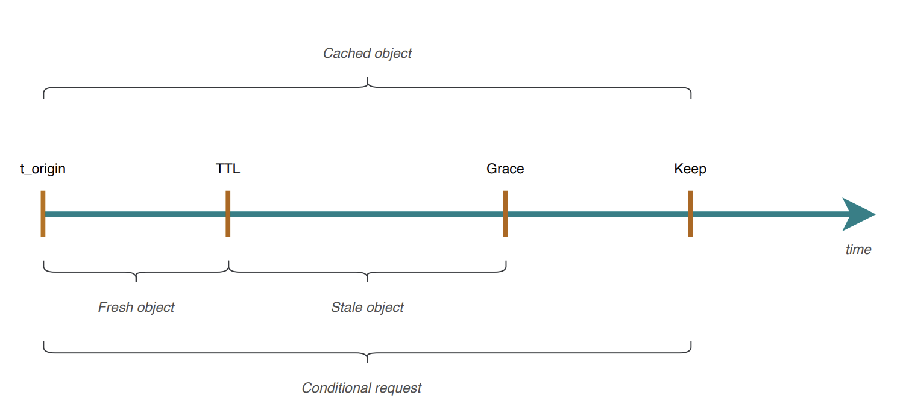

# Varnish

Sources:
 * https://varnish-cache.org/docs/trunk/tutorial/
 * https://varnish-cache.org/docs/trunk/users-guide/index.html#users-guide-index
 * https://www.varnish-software.com/developers/tutorials/
 * https://developer.mozilla.org/en-US/docs/Web/HTTP/Caching
 * https://docs.varnish-software.com/tutorials/object-lifetime/
 * https://docs.varnish-software.com/tutorials/
 * https://maxcluster.de/en/blog/performance-pagespeed-boosting-varnish-cache

## Introduction to Varnish

### How Varnish works

For each and every request, Varnish runs through the 'VCL' program to decide what should happen: Which backend has this content, for how long can we cache the response, is it accessible for this request, should it be redirected elsewhere and so on. If that particular backend is down, varnish can find another backend or substitute different content until it comes back up.

Your first VCL program will probably be trivial, for instance just splitting the traffic between two different backend servers:

```vcl
sub vcl_recv {
   if (req.url ~ "^/wiki") {
       set req.backend_hint = wiki_server;
   } else {
       set req.backend_hint = wordpress_server;
   }
}
```

When you load the VCL program into Varnish, it is compiled into a C-program which is compiled into a shared library, which varnish then loads and calls into, therefore VCL code is fast.

Everything Varnish does is recorded in 'VSL' log records which can be examined and monitored in real time or recorded for later use in native or NCSA format, and when we say 'everything' we mean everything.
These VSL log records are written to a circular buffer in shared memory, from where other programs can subscribe to them via a supported API. One such program is `varnishncsa` which produces NCSA-style log records:

`192.0.2.24 - - [08/Feb/2021:12:42:35 +0000] "GET http://vmods/ HTTP/1.1" 200 0 […]`

 * Varnish is also **engineered for uptime**, it is not necessary to restart varnish to change the VCL program, in fact, multiple VCL programs can be loaded at the same time and you can switch between them instantly.

### Caching with Varnish
When Varnish receives a request, VCL can decide to look for a reusable answer in the cache, if there is one, that becomes one less request to put load on your backend applications database. Cache-hits take less than a millisecond, often mere microseconds, to deliver.

If there is nothing usable in the cache, the answer from the backend can, again under VCL control, be put in the cache for some amount of time, so future requests for the same object can find it there.

Varnish understands the Cache-Control HTTP header if your backend server sends one, but ultimately the VCL program makes the decision to cache and how long, and if you want to send a different Cache-Control header to the clients, VCL can do that too.

### Limitations
(Not super sure, need to check in detail) In open-source version of varnish, the backend has to be HTTP because HTTPS is not supported. This is different in the payed version. 

### Starting Varnish Demo

1. Start the demo spring-boot application (runs on port 2222):

    `cd ./varnish-demo-app && mvn spring-boot:run`

(this is not needed, step 1 is enough) Start the demo spring-boot container:

    docker build -t varnish-demo-app ./varnish-demo-app/
    docker run -d --name app1 -p 2222:2222 --net var-net varnish-demo-app

2. Start the varnish container with your custom configuration:
```
    docker run \
        --rm \
        --name varnish \
        -p 8081:80 \
        -v ~/develop/personal/ci-cd-examples/varnish/default.vcl:/etc/varnish/default.vcl \
        varnish
```
3. Go to `localhost:2222` to get the uncached content and `localhost:8081` to get the cached content from varnish.
### Backend

Varnish has a concept of **backend** or origin servers. A backend server is the server providing the content Varnish will accelerate via the cache.

In our case `/etc/varnish/default.vcl`:

```vcl
vcl 4.0;

backend default {
  .host = "127.0.0.1";
  .port = "8080";
}
```

This means we set up a backend in Varnish that fetches content from the localhost on port 8080.
Varnish can have several backends defined and can even join several backends together into clusters of backends for load balancing purposes, having Varnish pick one backend based on different algorithms.

### General

**Configuration**: The Varnish Configuration is written in VCL (Varnish Configuration Language). When Varnish is ran, this configuration is transformed into C code and then fed into a C compiler, loaded and executed.

So, as opposed to switching various settings on or off, you write polices on how the incoming traffic should be handled.

**varnishadm**: Varnish Cache has an admin console. You can connect it through the `varnishadm` command. To connect, the user needs to be able to read `/etc/varnish/secret` in order to authenticate.

Once you’ve started the console you can do quite a few operations on Varnish, like stopping and starting the cache process, load VCL, adjust the built in load balancer and invalidate cached content.

**varnishlog**: <u>Varnish does not log to disk. Instead it logs to a chunk of memory</u>. It is actually streaming the logs. At any time you’ll be able to connect to the stream and see what is going on. Varnish logs quite a bit of information. You can have a look at the logstream with the command `varnishlog`.

**VMODs**: Varnish modules. For instance `std` has many useful functions. (See https://varnish-cache.org/docs/trunk/reference/vmod_std.html)

**Matches Operator ~**: This operator `~` takes in a regular expression and it also checks if the string is contained in the other string.
For example, the following if check will be true if the url contains the string `test`

```vcl
  if (req.url ~ "test") {
    return(synth(512, "Invalid URL"));
  }
```

## User Guide

## Default Caching Behavior
Most of the modern apps do not send any cache-related headers (Cache-Control), thus the default (TTL) **120 seconds** apply if you installed Varnish and haven’t configured much.

So let's say you send the first request, the server is hit and the response is then cached for 120 seconds. During that time, all requests will be served from cache and a new request in those 120 seconds won't extend/restart the cache. Once the time is up, the next request will hit the backend again and will be cached for another 120 seconds.

> Time to live (TTL) is the time that an object is stored in a caching system before it’s deleted or refreshed.

It's worth noting that **only specific status codes are cacheable** in Varnish by default (at least so in Varnish 4.1 series).
It means that neither default TTL nor "calculated TTL" (from caching headers like s-maxage) would apply for non-cacheable status codes.
So if your response code is any different than the ones listed below, you might have to create VCL tweaks in order to make those cacheable.

Cacheable status codes:

    200: OK
    203: Non-Authoritative Information
    300: Multiple Choices
    301: Moved Permanently
    302: Moved Temporarily
    304: Not modified
    307: Temporary Redirect
    410: Gone
    404: Not Found

When a response has any of the given codes, and Varnish finds no caching headers in backend’s response, the initial cache lifetime (TTL) for it, will be set to the default TTL.
This is how long Varnish will cache an object by default.

Content that is labeled as uncacheable will never be stored in Varnish Cache and will always be fetched from the origin. Content might be labeled as uncacheable if it has a `max-age` set at 0, if it has **cookies** attached, or because you don’t want it to be cached. By using VCL you can override headers set at your server that say content should not be cached, and even cache pages around content that is personalized. This means you should, in theory, be able to cache the majority of your requests and achieve a fast webpage for nearly all visitors.

## Object lifetime: TTL, Grace, Keep

Every copy of the content (aka object) stored in cache has a lifetime which defines how long an object can be considered fresh, or live, within the cache.



The lifetime of a cached object is represented by the above timeline. The life of an object starts at the `t_origin` which is the time when the object was inserted in cache.

On top of this Timestamp we have three duration attributes:
 1. TTL - Time To Live
 2. Grace
 3. Keep

**An object lives in cache until TTL + Grace + Keep elapses**, after that time the object is removed by the Varnish daemon. Objects within the TTL are considered fresh objects, while stale objects are those whose lifetime is between TTL and Grace, this is called grace period. Object lifetime between t_origin and keep is used for conditional requests using the HTTP Header field `If-Modified-Since`.

**Setting TTLs, Grace and Keep:** Setting the right lifetime durations is fundamental for a healthy cache, avoid the waste of resources such as cache storage and make sure the users have a great quality of experience.
* You can set TTLs, grace and keep **via VCL, CLI and HTTP headers**

Before diving in and understand lifetime settings using examples, let’s clarify how Varnish handles TTLs/Grace/Keep. Varnish, when fetching the content to be cached, <u>will first check if any TTL-related header has been set by the origin server (for instance `Cache-Control`)</u>. If it has been set by the origin server, then Varnish will honor it, but we could still change it either via VCL or Varnish parameters if we need to apply a modification. If no TTLs have been set by the origin server, then Varnish will apply its own default TTLs.

### 1. Set via VCL
The flexibility of VCL gives us the freedom to set, rewrite, adjust any header/lifetime we need/want.

The right place to set TTLs is the `vcl_backend_response` function, that’s the subroutine where the origin server response is processed by Varnish and that’s where objects attributes can be changed before the content is stored in cache. Once an object is in cache it can’t be modified anymore.

An example for video content delivery:
```vcl
sub vcl_backend_response {
	# We first set TTLs valid for most of the content we need to cache
	set beresp.ttl = 10m;
	set beresp.grace = 2h;

	# We can now set specific TTLs based on the content we need to cache
	# For VoD content we set a medium-long TTL and a long grace as the VoD
	# content is very unlikely to change. This allow us to use the cache
	# for the most-requested content
	if (beresp.url ~ "/vod") {
		set beresp.ttl = 30m;
		set beresp.grace = 24h;
	}

	# For live content we use a very small TTL and a even smaller grace period
	# that's because live content is no longer *live* once it is consumed
	if (beresp.url ~ "/url") {
		set beresp.ttl = 10s;
		set beresp.grace = 2s;
	}

	# We expand the *keep* duration for IMS
	if (bereq.http.If-Modified-Since) {
		set beresp.keep = 10m;
	}
}
```

### 2. Set via CLI
See https://docs.varnish-software.com/tutorials/object-lifetime/#2-set-via-cli-cli

### 3. Set via HTTP headers
As mentioned in the introduction, <u>an HTTP caching strategy should start from the origin server(s), where the content is created, therefore it is really important to understand that we have a full set of HTTP headers we can use to define TTLs</u>.

Setting HTTP headers at the origin server is advisable, but if somehow those headers are not defined when the content is created you can always rely on VCL as explain at point 1.

 * `Cache-Control` header specifies directives which must be respected by all caching mechanisms. `Cache-Control: public, max-age=36000` means the response can be cached by any cache and it will be considered fresh for 36000 seconds Cache control has many directives which can be request or response specific. Check the RFC for more details.
* The `Expires` header field gives the date/time after which the response is considered stale. For example Expires: `Thu, 01 Dec 2020 16:00:00 GMT`
* The `Age` header field conveys the sender’s estimate of the amount of time since the response was generated or successfully validated at the origin server.
* `Etag`, `Last-Modified`, `If-Modified-Since`, `If-None-Match` these are conditional headers and must be used when sending cache validation request. The scope of those headers is to indicate if a cache has the most-up-to date version of the cached content or if fresher content can be server by the origin server. In example, if a client send a GET or a HEAD request with a `If-Modified-Since: Tue, 29 Oct 2019 19:43:31 GMT`, Varnish will revalidate the available content in cache by sending a conditional request to the origin server to check if the request content has been modified after Sat, 29 Oct 2019 19:43:31 GMT


### Examples for HTTP Cache Headers and Varnish Behavior
Read more about it here: https://developer.mozilla.org/en-US/docs/Web/HTTP/Caching, it goes into detail about freshness, stale etc.

 * `Cache-Control: no-store`: Varnish won't cache the response.
 * `Cache-Control: max-age=40`: overrides the TTL to 40 seconds, instead of the default 120 seconds.

### Deciding on the correct default TTL value
The common approach to the matter of deciding on the correct value depends on your application. But for the most part, the correct strategy is setting the default TTL to a **really high value**: raise it to 2 weeks, and **make your application send a PURGE request to Varnish** when there’s a need to invalidate an object in the cache.
Or to adjust the caching by using the standard HTTP caching related headers like described in previous sections.

## Custom Headers From Varnish
Varnish will add some headers to its responses to the client:
 * `X-Varnish`: Custom Header. **TODO**
 * `Age`: Indicates the number of seconds the object has been in a proxy cache. If your second request is 30 seconds after the original, you'll get a header like `Age: 30`.
 * `Via`: Added by proxies and used to track message forwards, avoid request loops and identify protocol capabilities of senders. An example value is `1.1 b9d852e004f0 (Varnish/7.2)`

## Directors
https://varnish-cache.org/docs/6.1/reference/vmod_directors.generated.html

 * directors.round_robin()
 * directors.fallback(BOOL sticky=0)
 * directors.shard()
 * directors.shard_param()
 * directors.random()
 * directors.hash()

### Shard
What makes the shard director so interesting is the fact that it uses **consistent hashing** with **replica support**.

When a backend is out of commission, its keys are remapped to other nodes while it is unavailable. When the backend becomes healthy again, it will receive its original hashes again.

 * For more details: (Varnish 6 by example) 7.5.1 Shard director - Key mapping and remapping

## HEAD -> GET
TODO: Varnish internally changes HEAD to GET before fetching, so client-sent HEAD requests trigger a GET in backends. That response is then cached, so not ever HEAD triggers a new GET.

For example, sending a `HEAD` request to `localhost:8080/path` (varnish) triggers a `GET` request to the backend with path `/path`. This response is then cached and any subsequent `GET` or `HEAD` request will be served from the cache.


## Varnish Cache And HTTPS
One hurdle of Varnish Cache is that it is designed to accelerate HTTP, not the secure HTTPS protocol. As more and more websites are moving all of their pages to HTTPS for better protection against attacks, this has become something many Varnish Cache users have to work around. To enforce HTTPS with Varnish Cache you will need to put an SSL/TLS terminator in front of Varnish Cache to convert HTTPS to HTTP.

One way to do this is by using Nginx as the SSL/TLS terminator. Nginx is another reverse proxy that is sometimes used to cache content, but Varnish Cache is much faster. Because Nginx allows for HTTPS traffic, you can install Nginx in front of Varnish Cache to perform the HTTPS to HTTP conversion. You should also install Nginx behind Varnish Cache to fetch content from your origin over HTTPS.
(see more in pdf 'varnish-cache-guide.pdf')

## What Content To Cache With Varnish Cache

Caching a range of content is where Varnish Cache’s flexibility really shines. With Varnish Cache, you can cache what is sometimes called “dynamic content” but usually refers to the HTML document, and cache content around personalized elements using a “hole punching” technique. Examples of content that can be cached with Varnish Cache include:
 * Images (PNG, JPG, GIF files) 
 * CSS stylesheets and fonts
 * JavaScript
 * Downloadable files
 * Full HTML documents

Varnish Cache also allows for caching the HTML document **even when it includes personalized elements** such as **cart size** and **account information**. Using Varnish Cache Configuration Language and a technique called **“hole punching”** websites can configure their pages so that a majority of the content can be served from cache. In the next section we go into VCL and how to use it to cache all types of content.

## Subroutines

### vcl_recv
`vcl_recv` is used to normalize the request (for example removing www), decide if a request should be looked up in the cache based on its headers, and execute rewrite rules for certain web applications. What happens to a request in `vcl_recv` will determine where it is sent to next and ultimately if Varnish Cache will try to cache the request or not. The following actions in `vcl_recv` will terminate `vcl_recv` and pass the request on to the appropriate next subroutine:

 * **Pass**: A request marked pass will not be looked up in the cache but will execute the remainder of the Varnish Cache flow to fetch the object from the back end (`vcl_pass`). A request marked “pass” will not be stored in the cache once it is delivered to the user from the back end, and this response would be used **for objects that you do not want to cache** such as personalized information.
 * **Pipe**: Piped requests go directly to the back end without Varnish Cache looking at their content. These requests go to `vcl_pipe` and then essentially skip the Varnish Cache flow and are therefore not cached or logged in Varnish Cache. If a request is piped, any other request using the same keep-alive connection will also be piped. Examples of requests that may be marked “pipe” include music streaming.
 * **Hash**: Hash is the lookup function of Varnish Cache, as every request going through Varnish Cache is given a unique numbered identifier. Responding “hash” in the `vcl_recv` section means the request has no immediate flags saying it has not been cached, so Varnish Cache should look it up in the cache in the `vcl_hash` routine. This action will be used for items that should be cached, for example any URL in an `/images/` folder.
 * **Synth**: This is used to generate a response from Varnish Cache, such as an error message, or to redirect requests as set in the `vcl_synth` routine. One use case is redirects at the edge or denying access to certain requests.

`vcl_recv` is also where you can block specific IP addresses or ranges of IPs if you are seeing unusual activity come from certain
locations. This is achieved by using VCL such as the below example:

```vcl
acl unwanted { "69.60.116.0"/24; "69.90.119.207"; }

sub vcl_recv { 
  if (client.ip ~ unwanted) { 
    return(synth(403, "Access denied")); 
  } 
}
```

### vcl_hash
This routine is where Varnish gives each object a numerical unique identifier and then looks up if that object is already in the cache. **The built-in VCL will add the IP address and URL of the object to the cache hash**. In this section you can also add identifiers for user-specific data (i.e. cookies), however it is recommended that you do this with caution so you don’t accidentally share user-specific data.

`vcl_hash` only terminates by returning the `lookup` keyword which is not a subroutine but an action which tells Varnish Cache if the specified object is in the cache or not. If an item is in the cache then the request will go to `vcl_hit` and `vcl_deliver`. If the item is not in the cache it will be flagged “busy” and added to the cache, then (assuming it is cacheable) go through the `vcl_miss` and `vcl_fetch` routines and be added to the cache with the “busy” flag removed. If new visitors request the same object while the `vcl_miss` routine is being executed they will be placed in a waiting state until the item is cached. These users will be given the “hit-for-pass” response which is usually itself cached for a minute or two.
Once `vcl_hash` has completed the lookup action it will move the request on to the next subroutine, which will usually be `vcl_hit` or `vcl_miss`.

## Varnish and Cookies
An issue I had: Varnish did not cache when called from browser but caches when called from Postman.
This was because my browser had some cookies for other applications running on localhost (different ports).

 * Varnish will, in the default configuration, not cache an object coming from the backend with a `Set-Cookie` header present.
 * Also, if the client sends a Cookie header, Varnish will bypass the cache and go directly to the backend.

This can be overly conservative. A lot of sites use Google Analytics (GA) to analyze their traffic. GA sets a cookie to track you. This cookie is used by the client side javascript and is therefore of no interest to the server.

Read more: https://varnish-cache.org/docs/3.0/tutorial/cookies.html

## redirect_to cookie
Varnish sets a cookie like `"/d/8ZQ3pN-4k/varnish?orgId=1&refresh=5s&from=now-15m&to=now"`
TODO - what is this used for?

## Varnish logging
By default any installation of `varnishd` **will not write any request logs to disk**. Instead Varnish has an in-memory log, and supplies tools to tap into this log and write to disk. You can start the `varnishncsa.service` which comes bundled with the varnish linux package if you want to write log files to disk.

**Advanced logging**: The `varnishlog`, `varnishtop`, and `varnishncsa` tools allow you to perform deep introspection into the Varnish flow, the input and output
**Advanced statistics**: The `varnishstat` tool displays numerous counters that give you a global insight into the state of your Varnish server

### Varnishlog vs varnishncsa
`varnishlog` is a tool that provides real-time logging of all Varnish requests and responses. It shows a detailed log of all client requests, backend requests, and cache hits and misses. This tool is particularly useful for troubleshooting and debugging Varnish-related issues. Varnishlog output is in a more verbose format and can be configured to filter and display specific information like request headers, response status, cache hit/miss, etc.

On the other hand, `varnishncsa` is a tool that parses the Varnish log files and generates an Apache-style log format for easy analysis and reporting. The log format is customizable, and the output is easier to read, making it a useful tool for generating reports and analyzing web traffic data. The Varnishncsa output is similar to the Apache web server access log format.

### varnishncsa
When Varnish is installed using the official Linux packages, a `varnishncsa.service` systemd service is automatically created.
The contents of this service can be viewed by running the following command: `sudo systemctl cat varnishncsa`.
In Ubuntu this service file is under `/lib/systemd/system/varnishncsa.service`.

This service runs the following command:
`/usr/bin/varnishncsa -a -w /var/log/varnish/varnishncsa.log -D`

This command continuously appends the output from varnishncsa to `/var/log/varnish/varnishncsa.log`. This command is daemonized through the `-D` option.

#### Enabling the varnishncsa service
The `varnishncsa.service` systemd service is **not enabled by default**. Because Varnish is so powerful and can handle so many concurrent requests, the **sheer number of log lines written to the varnishncsa.log file can potentially overwhelm the system**.
 * Please only enable varnishncsa.service if you know your disk and your system can keep up with the number of log lines that varnishncsa is writing to the varnishncsa.log log file.

#### varnishncsa custom format
Specify the log format to use. If no format is specified the default log format is used:

 * `%h %l %u %t "%r" %s %b "%{Referer}i" "%{User-agent}i"`
 * Looks like this: `172.17.0.1 - - [12/Mar/2023:11:04:41 +0000] "GET http://localhost:8061/ HTTP/1.1" 200 44 "-" "Mozilla/5.0 (Macintosh; Intel Mac OS X 10.15; rv:109.0) Gecko/20100101 Firefox/110.0"`

Some options:
 * %h                            - Remote host. Defaults to ‘-’ if not known. In backend mode this is the IP of the backend server.

 * %l                            - Remote logname. Always `-`.

 * %u                            - Remote user from auth

 * %t                            - In client mode, time when the request was received, in HTTP date/time format. 
                                In backend mode, time when the request was sent.

 * %r                            - The first line of the request (for example `GET http://localhost:8061/ HTTP/1.1`)

 * %s                            - Status sent to the client. In backend mode, status received from the backend.

 * %b                            - In client mode, size of response in bytes, excluding HTTP headers (only the body). 
                                In backend mode, the number of bytes received from the backend, excluding HTTP headers. In CLF format, i.e. a ‘-’ rather than a 0 when no bytes are sent.

 * %{X}i                         - (for example "%{User-agent}i") The contents of request header X. 
                                If the header appears multiple times in a single transaction, the last occurrence is used.
 * %{X}o                         - (for example [%%{Last-Modified}o]) The contents of response header X. 
                                If the header appears multiple times in a single transaction, the last occurrence is used.
 * %{X}x                         - Extended variables. (for example %{Varnish:handling}x)

 * %D                            - In client mode, time taken to serve the request, in microseconds. 
                                In backend mode, time from the request was sent to the entire body had been received. This is equivalent to %{us}T.

#### Filter logs
**Only log errors**: In order to only log for response or backend response status codes above 399, add this query:
`-q "RespStatus >= 400 or BerespStatus >= 400"`

**Log problem requests**:To log all requests that took more than two seconds to be delivered, or with a non 200 response status add this query:
`-q "Timestamp:Resp[3] > 2.0 or RespStatus != 200"`

**Limit log to a certain domain**: To only log requests for a certain domain (example.com in this case), add the following:
`-q "ReqHeader ~ '^Host: .*\.example.com'"`

#### Rotating logs
On a high volume system, logging to disk will quickly eat up disk, and it is imperative that you set up proper log rotation. Most varnish packages that supply a `varnishncsa` service will also supply a base config for `logrotate`, but configuring this depends heavily on your setup and traffic.

Example config file for varnish, `/etc/logrotate.d/varnish`
```
/var/log/varnish/varnishncsa.log {
  rotate 10
  size 500M
  compress
}
```
This configuration basically means that if the specified file is larger then 500 MB, it will be compressed and rotated.
Rotated means just it gets a suffix like `-1`, `-2` etc (`varnishncsa.log-1.gz`, `varnishncsa.log-2.gz`...). This will be done 10 times and when 10 rotated/old log files are present, the oldest one will be deleted when a new file is rotated. This **does not happen automatically**, it is important that the `logrotate` should be called regularly to check if files have to be rotated.

See `linux.md#logrotate` for more details.

#### Rate limiting
If the `varnishncsa.service` has too much of an impact on your disk or the performance of your system, you can reduce the output of varnishncsa by adding rate limiting. Rate limiting suppresses VSL transactions that exceed the limit. The `-R` option allows you to set the limit for a given duration.

Here’s an example where we only log one line every 10 seconds: `varnishncsa -R 1/10s`


## Reloading new configuration without restarting Varnish
https://ma.ttias.be/reload-varnish-vcl-without-losing-cache-data/

### varnishlog
AFAIK `varnishlog` logs are not saved to the file and there is also not a service like `varnishncsa.servivce` which can be configured. But a similar service can be implemented easily.

By default when you run `sudo varnishlog`, it does not show every type of log lines. 
You can do `sudo varnishlog -g raw` to see more.

#### Health check logs
You can see the health check status logs if you run `sudo varnishlog q raw -i Backend_health` (shows only logs with the `Backend_health` tag)

You will see similar logs like this every X seconds, depending on your `probe` config:

    0 Backend_health - boot.default Still healthy 4---X-RH 9 3 9 0.008557 0.010972 HTTP/1.1 200 
    0 Backend_health - boot.default Still healthy 4---X-RH 9 3 9 0.013052 0.011492 HTTP/1.1 200


## ...

